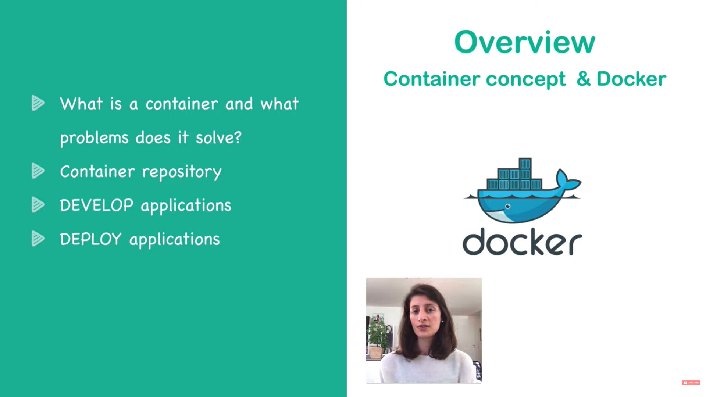
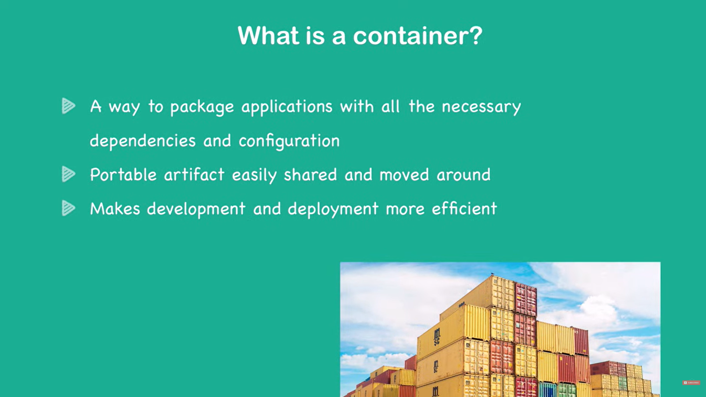
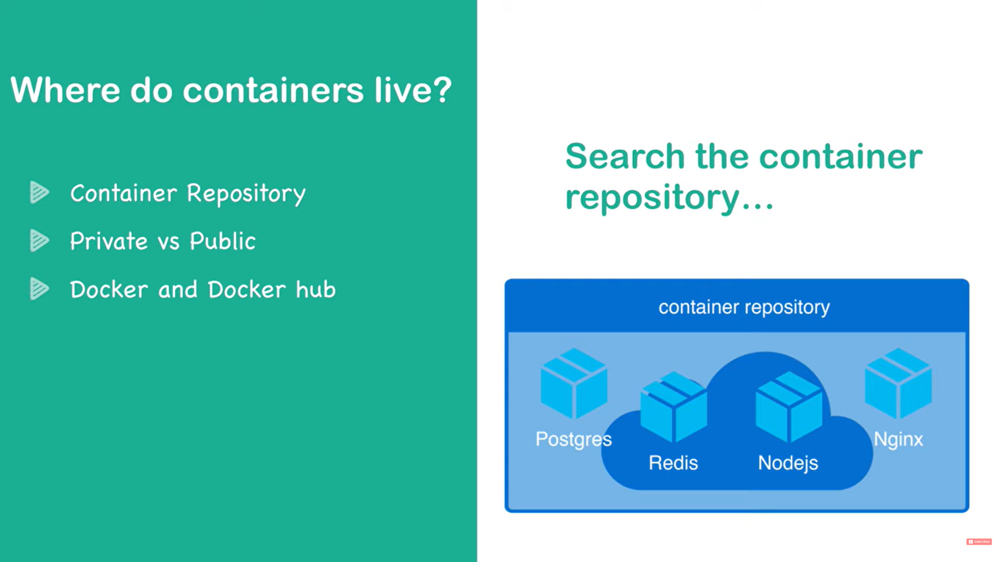
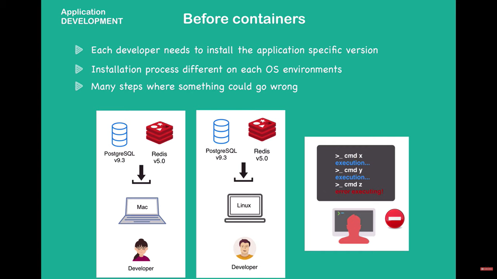
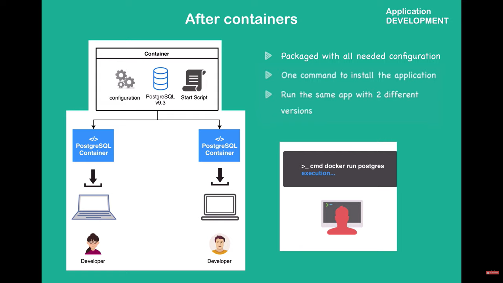
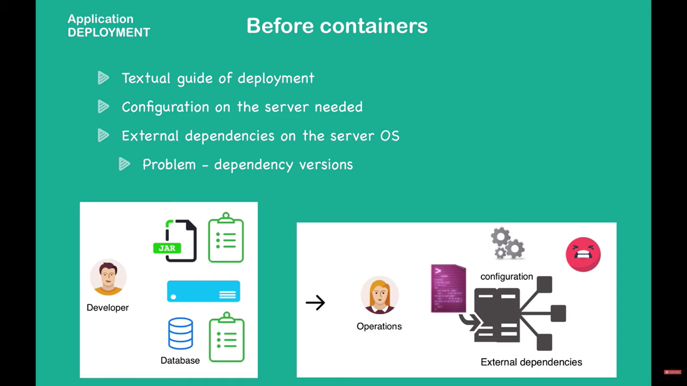
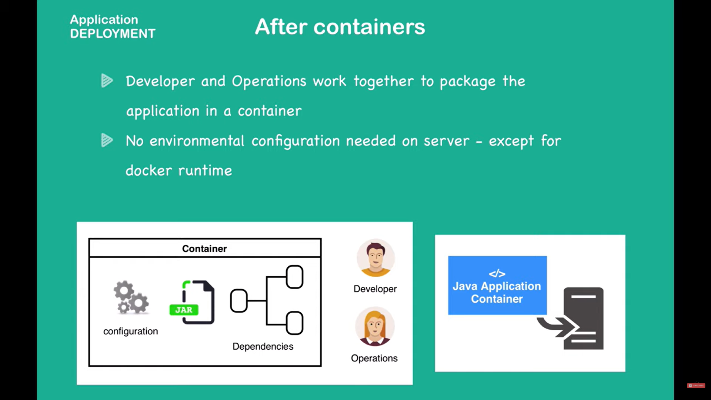

**Application Development**
How do we develop applications without containers? 

After containers, you don't need to install dependencies on your system directly

**Application Deployment** before containers:

After container, application deployment:
