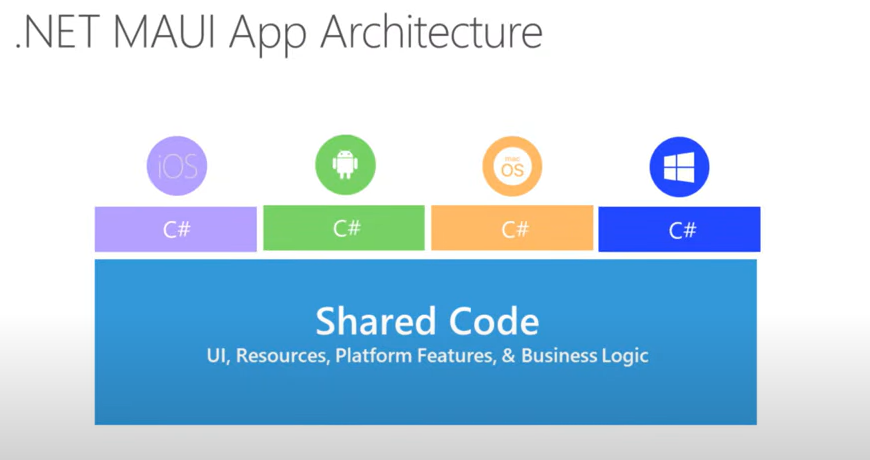
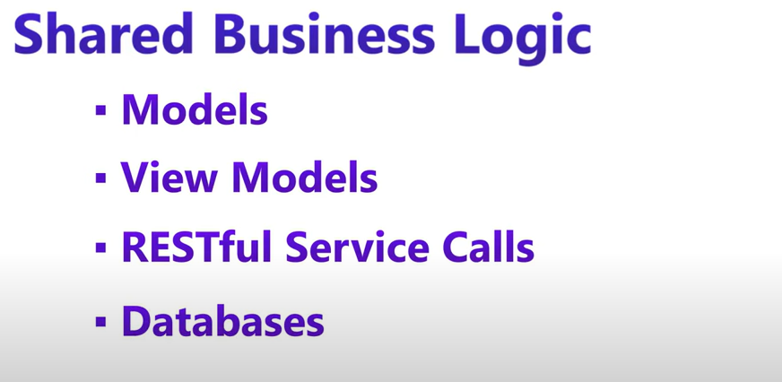
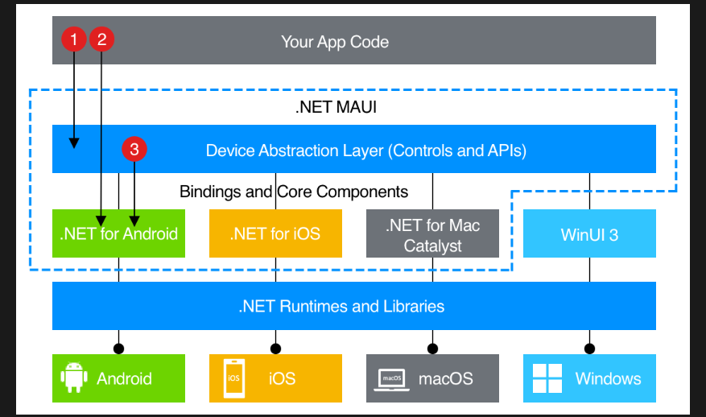
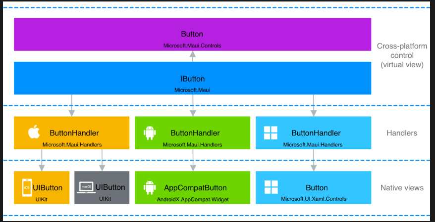

### **Architecture of .NET MAUI**  
.NET Multi-platform App UI (**.NET MAUI**) is an evolution of Xamarin.Forms that enables developers to build **cross-platform applications** using a **single codebase**. It allows apps to run on **Android, iOS, Windows, and macOS** using **C# and .NET**.

---

## **1. High-Level Architecture**  
.NET MAUI follows a layered architecture that includes:  
### **🟢 Application Layer (UI & Business Logic)**
- **XAML (or C#) for UI**  
  - Defines the UI structure.
  - Uses **.NET MAUI controls** for cross-platform UI elements.
- **MVU, MVVM, or Reactive patterns**  
  - Supports **Model-View-Update (MVU)**, **Model-View-ViewModel (MVVM)**, and **Blazor Hybrid**.
- **Platform-Specific Customization**  
  - Uses the **MauiApp** class to configure services and dependencies.

### **🟡 .NET MAUI Core Layer**
- **Cross-platform UI Abstraction**  
  - Provides a single API surface for UI rendering.
- **Handlers** (Replaces Renderers from Xamarin)  
  - Converts .NET MAUI UI elements into platform-native elements efficiently.
- **Essentials API**  
  - Access to **device features** like GPS, camera, accelerometer, and sensors.

### **🔵 Native Platform Layer**
- **Android** → Native **Java/Kotlin** under the hood.  
- **iOS** → Native **Swift/Objective-C** under the hood.  
- **Windows** → Uses **WinUI** as its rendering engine.  
- **macOS** → Uses **Mac Catalyst** for Mac apps.  

---

## **2. Detailed Layered Architecture**
### **🔷 .NET MAUI Abstraction Layer**
- Contains **cross-platform UI components** that are mapped to native platform controls using **Handlers**.

### **🔶 Handlers (Bridge between MAUI and Native Code)**
- Unlike Xamarin **Renderers**, **Handlers** provide **faster, lightweight communication** between MAUI UI and native platforms.  
- **Example:**  
  - `Button` in MAUI → Mapped to **Android’s Button, iOS UIButton, Windows Button**.

### **🔷 Native UI & Platform APIs**
- Platform-specific UI and APIs handle device interactions.

---

## **3. Execution Flow**
1. **User interacts with the UI.**
2. **.NET MAUI Handler** translates UI elements into **native controls**.
3. **Native platform APIs** execute the logic and return data.
4. **Results are displayed back in the UI.**

---

## **4. Key Features of .NET MAUI Architecture**
✅ **Single Codebase** – One codebase for **Android, iOS, Windows, and macOS**.  
✅ **Hot Reload** – Allows live UI changes without restarting the app.  
✅ **Dependency Injection** – Uses **Microsoft.Extensions.DependencyInjection**.  
✅ **MVVM & MVU Support** – Works with **MVVM, MVU, and Blazor Hybrid**.  
✅ **Performance Optimized** – Uses **Handlers instead of Renderers** for speed.  

---

### **Comparison: .NET MAUI vs Xamarin.Forms**
| Feature | .NET MAUI | Xamarin.Forms |
|---------|----------|---------------|
| UI Rendering | **Handlers (Faster)** | Renderers (Slower) |
| Platforms | **Android, iOS, Windows, macOS** | Android, iOS, Windows |
| Project Structure | **Single Project** | Separate Projects |
| Performance | **Optimized** | Moderate |

