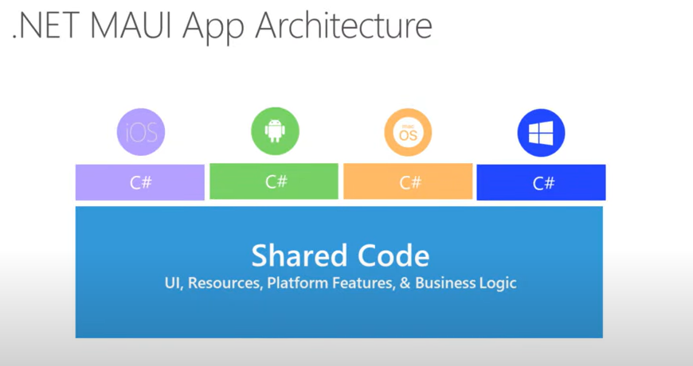
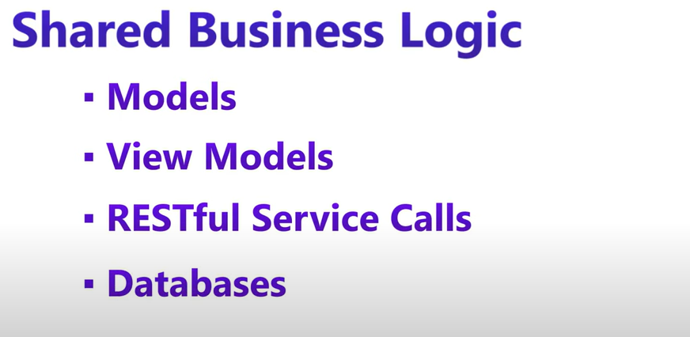
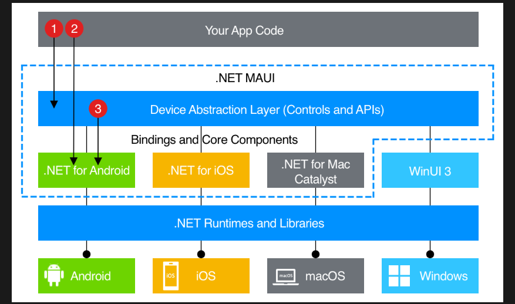
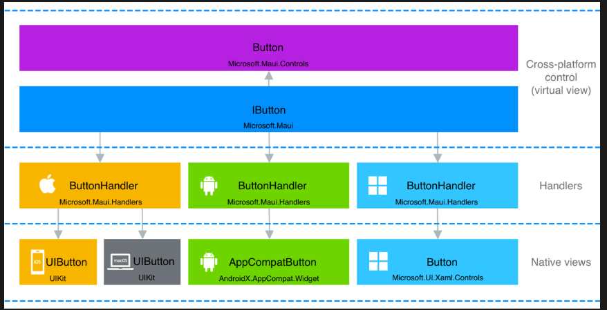

### **Architecture of .NET MAUI**  
.NET Multi-platform App UI (**.NET MAUI**) is an evolution of Xamarin.Forms that enables developers to build **cross-platform applications** using a **single codebase**. It allows apps to run on **Android, iOS, Windows, and macOS** using **C# and .NET**.

---

## **1. High-Level Architecture**  
.NET MAUI follows a layered architecture that includes:  
### **🟢 Application Layer (UI & Business Logic)**
- **XAML (or C#) for UI**  
  - Defines the UI structure.
  - Uses **.NET MAUI controls** for cross-platform UI elements.
- **MVU, MVVM, or Reactive patterns**  
  - Supports **Model-View-Update (MVU)**, **Model-View-ViewModel (MVVM)**, and **Blazor Hybrid**.
- **Platform-Specific Customization**  
  - Uses the **MauiApp** class to configure services and dependencies.

### **🟡 .NET MAUI Core Layer**
- **Cross-platform UI Abstraction**  
  - Provides a single API surface for UI rendering.
- **Handlers** (Replaces Renderers from Xamarin)  
  - Converts .NET MAUI UI elements into platform-native elements efficiently.
- **Essentials API**  
  - Access to **device features** like GPS, camera, accelerometer, and sensors.

### **🔵 Native Platform Layer**
- **Android** → Native **Java/Kotlin** under the hood.  
- **iOS** → Native **Swift/Objective-C** under the hood.  
- **Windows** → Uses **WinUI** as its rendering engine.  
- **macOS** → Uses **Mac Catalyst** for Mac apps.  

---

## **2. Detailed Layered Architecture**
### **🔷 .NET MAUI Abstraction Layer**
- Contains **cross-platform UI components** that are mapped to native platform controls using **Handlers**.

### **🔶 Handlers (Bridge between MAUI and Native Code)**
- Unlike Xamarin **Renderers**, **Handlers** provide **faster, lightweight communication** between MAUI UI and native platforms.  
- **Example:**  
  - `Button` in MAUI → Mapped to **Android’s Button, iOS UIButton, Windows Button**.

### **🔷 Native UI & Platform APIs**
- Platform-specific UI and APIs handle device interactions.

---

## **3. Execution Flow**
1. **User interacts with the UI.**
2. **.NET MAUI Handler** translates UI elements into **native controls**.
3. **Native platform APIs** execute the logic and return data.
4. **Results are displayed back in the UI.**

---

## **4. Key Features of .NET MAUI Architecture**
✅ **Single Codebase** – One codebase for **Android, iOS, Windows, and macOS**.  
✅ **Hot Reload** – Allows live UI changes without restarting the app.  
✅ **Dependency Injection** – Uses **Microsoft.Extensions.DependencyInjection**.  
✅ **MVVM & MVU Support** – Works with **MVVM, MVU, and Blazor Hybrid**.  
✅ **Performance Optimized** – Uses **Handlers instead of Renderers** for speed.  

---

### **Comparison: .NET MAUI vs Xamarin.Forms**
| Feature | .NET MAUI | Xamarin.Forms |
|---------|----------|---------------|
| UI Rendering | **Handlers (Faster)** | Renderers (Slower) |
| Platforms | **Android, iOS, Windows, macOS** | Android, iOS, Windows |
| Project Structure | **Single Project** | Separate Projects |
| Performance | **Optimized** | Moderate |

This image represents the architecture of **.NET MAUI (Multi-platform App UI)**, Microsoft's modern cross-platform framework that replaces Xamarin.Forms. It shows how **.NET MAUI enables a single codebase** to run on multiple platforms.

### **Breakdown of the Image:**
1. **Your App Code (Top Gray Block)**
   - This is your application's shared code, including UI, business logic, and platform-independent logic.
   - You write this code **once**, and it runs on different platforms.

2. **.NET MAUI (Blue Dashed Box)**
   - Acts as an **abstraction layer**, meaning it provides a common way to interact with different platform-specific components.
   - It includes **controls and APIs** that work across Android, iOS, macOS, and Windows.

3. **Device Abstraction Layer (Middle Blue Box)**
   - It **binds your app code to platform-specific components**.
   - Instead of writing separate code for Android, iOS, macOS, and Windows, **.NET MAUI handles it for you**.

4. **Platform-Specific Implementations**
   - .NET MAUI uses **.NET for Android, .NET for iOS, .NET for Mac Catalyst, and WinUI 3** to communicate with native APIs of different platforms.
   - These bindings allow access to native features like the camera, sensors, and notifications.

5. **.NET Runtimes and Libraries (Bottom Blue Box)**
   - Provides the core functionalities of .NET (memory management, garbage collection, threading, etc.).
   - Ensures apps run efficiently on **Android, iOS, macOS, and Windows**.

6. **Platform-Specific Execution (Bottom Row)**
   - The final compiled app runs on its respective OS (Android, iOS, macOS, Windows).

### **Key Takeaways:**
✅ **Write once, run everywhere** – No need to write platform-specific UI or business logic.  
✅ **Uses native bindings** – Apps can access platform-specific APIs when needed.  
✅ **Successor to Xamarin.Forms** – .NET MAUI offers a more unified and improved way to build cross-platform apps.  

This image illustrates the **Handler Architecture in .NET MAUI**, specifically for a `Button` control. It explains how **cross-platform UI components** are translated into **native UI elements** on different platforms.

---

### **Breakdown of the Image:**
#### **1. Cross-Platform Control (Virtual View)**
- **Button (`Microsoft.Maui.Controls`)** (Purple Box)  
  - This is the **abstract, cross-platform button** defined in .NET MAUI.  
  - It is what developers use when writing their UI code.

- **IButton (`Microsoft.Maui`)** (Blue Box)  
  - This is an **interface** that defines the common behavior for buttons across all platforms.  
  - It ensures that a button behaves the same way on **iOS, Android, macOS, and Windows**.

---

#### **2. Handlers (Middle Layer)**
- Handlers **bridge the gap between the cross-platform control and the native view**.
- Each platform has its own **ButtonHandler**:
  - **iOS/macOS → ButtonHandler (`Microsoft.Maui.Handlers`)**
  - **Android → ButtonHandler (`Microsoft.Maui.Handlers`)**
  - **Windows → ButtonHandler (`Microsoft.Maui.Handlers`)**

---

#### **3. Native Views (Platform-Specific Implementations)**
- These are the actual **native buttons** used on each platform:
  - **iOS/macOS → `UIButton` (UIKit)**
  - **Android → `AppCompatButton` (AndroidX.AppCompat.Widget)**
  - **Windows → `Button` (Microsoft.UI.Xaml.Controls)**

---

### **Key Takeaways:**
✅ **Handlers replace renderers from Xamarin.Forms** – Making UI rendering more lightweight and faster.  
✅ **Customizable UI** – Developers can override handlers to modify platform-specific behavior.  
✅ **Efficient Rendering** – Unlike Xamarin.Forms, .NET MAUI **directly maps to native controls**, reducing overhead.  

