**Introduction to Sql**
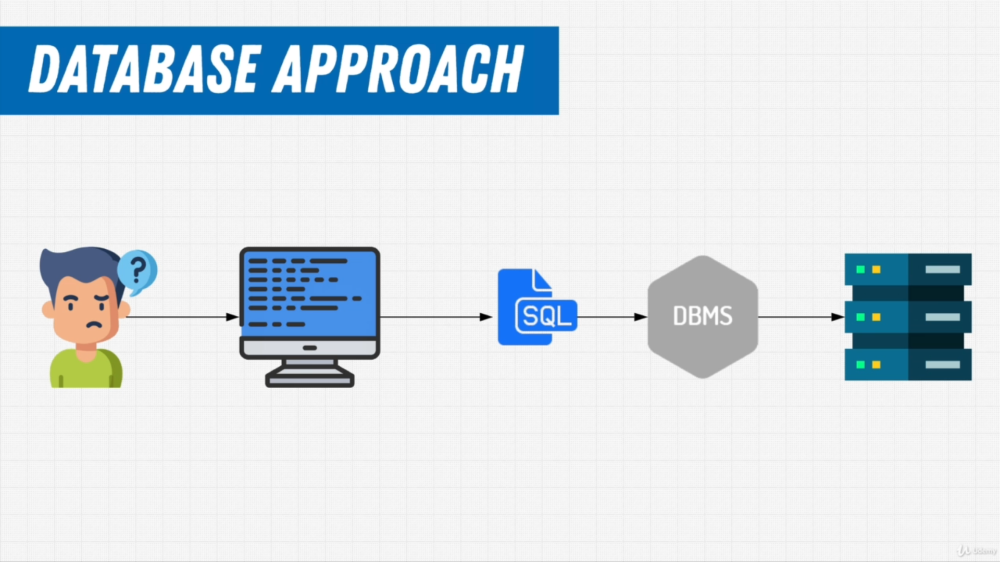
**Database Models**
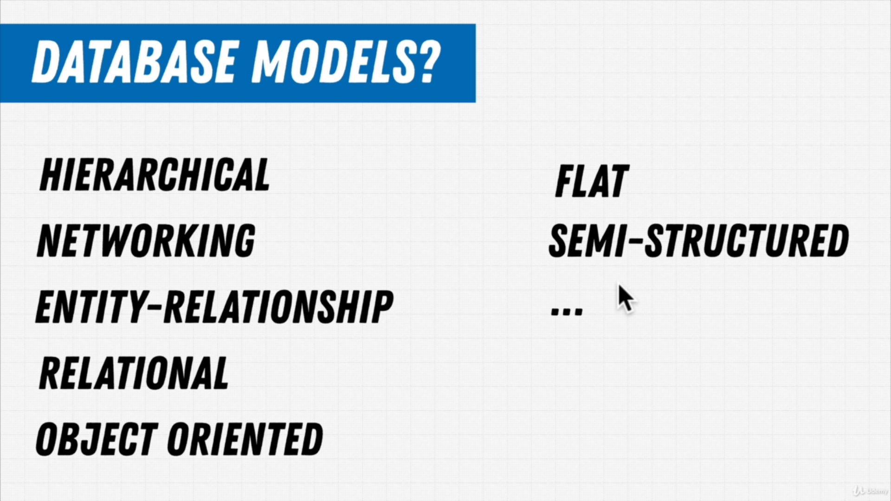
**Hierarchical Model**
Every node has one parent and can have many child nodes, xml format was used to save data.
It supported one to many relationship.
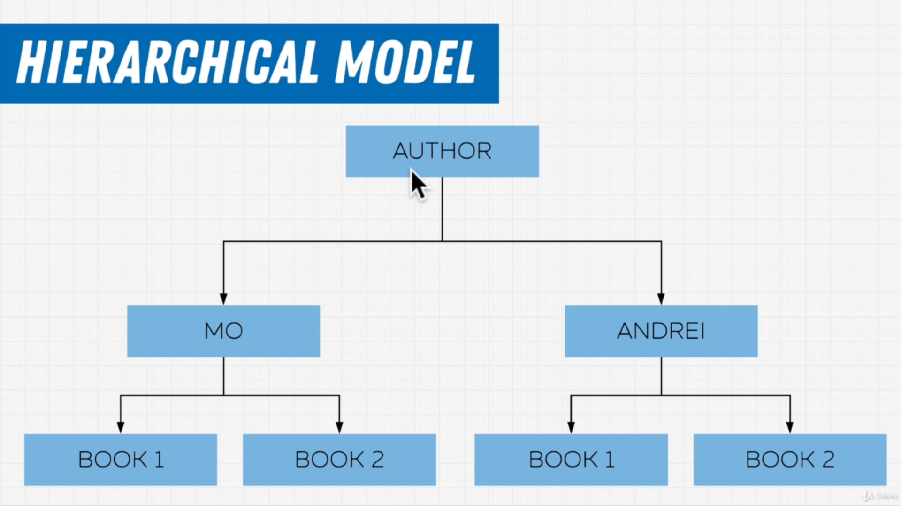
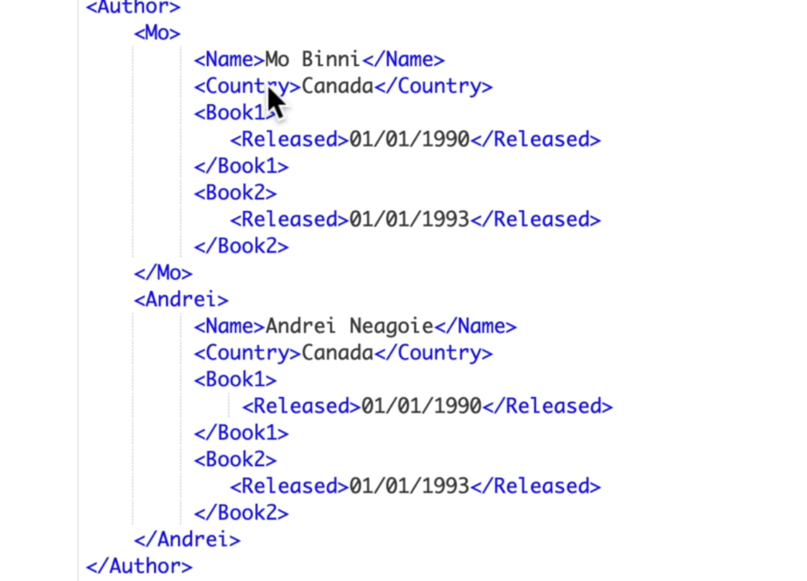
**Network Model**
A child can have multiple parents.
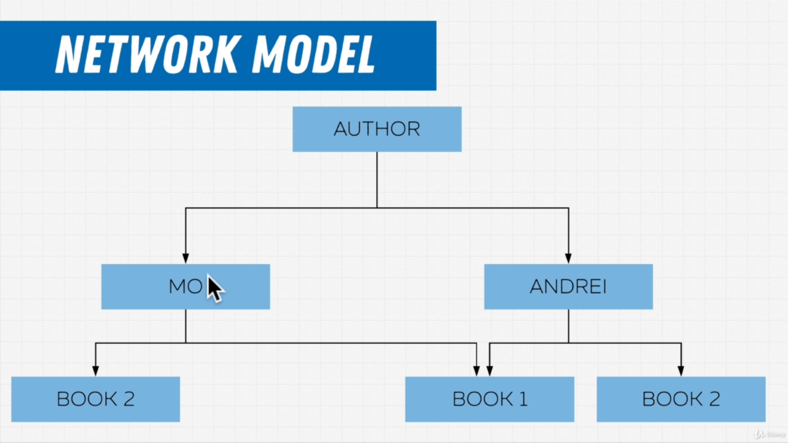
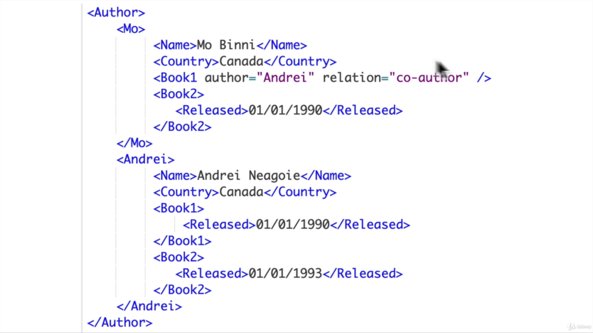

**Relational Model**
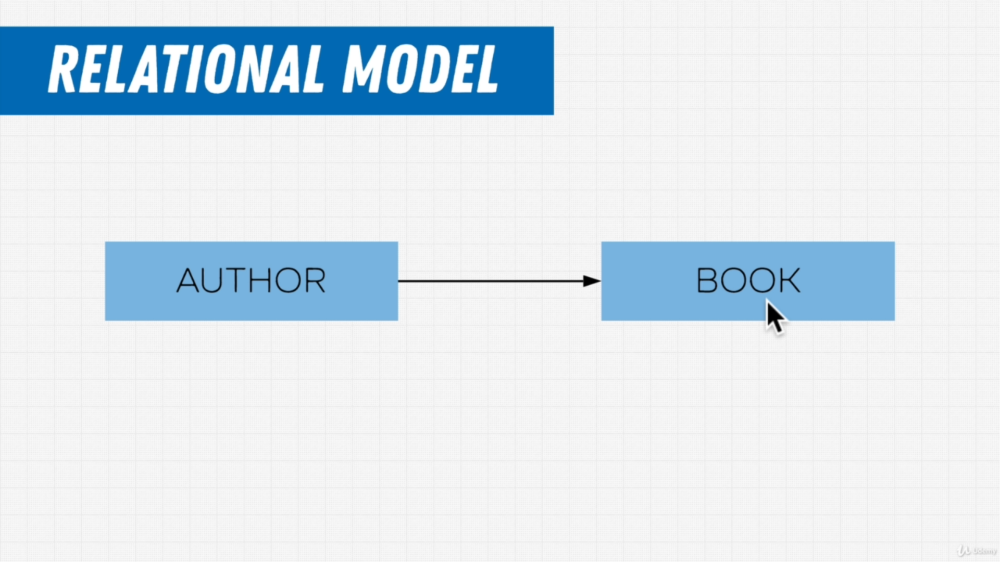
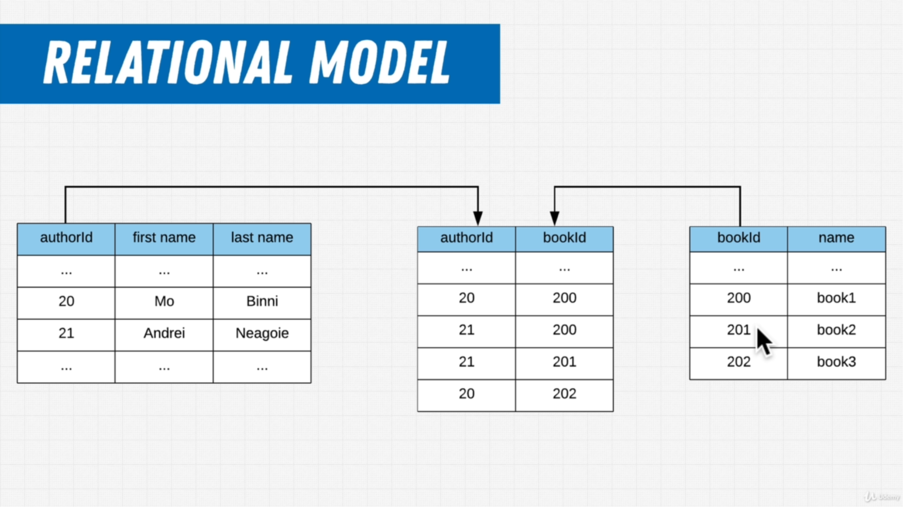

**RDMS**
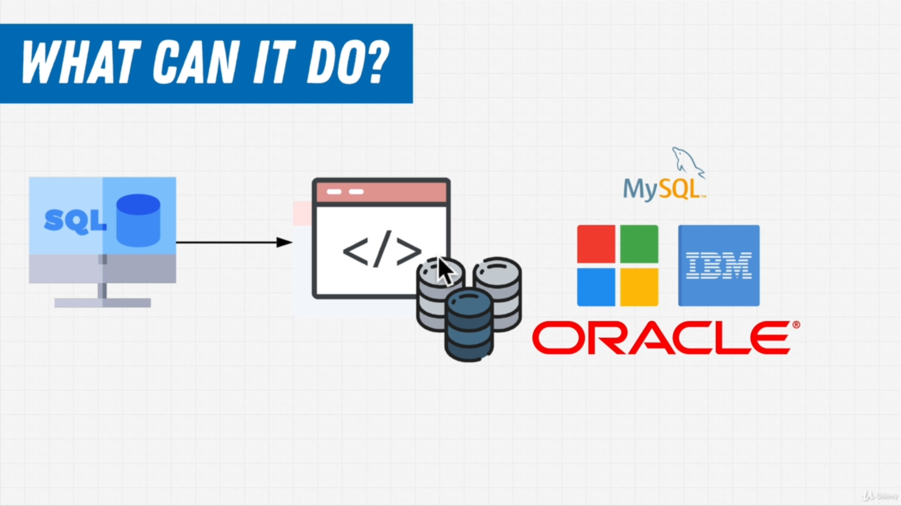
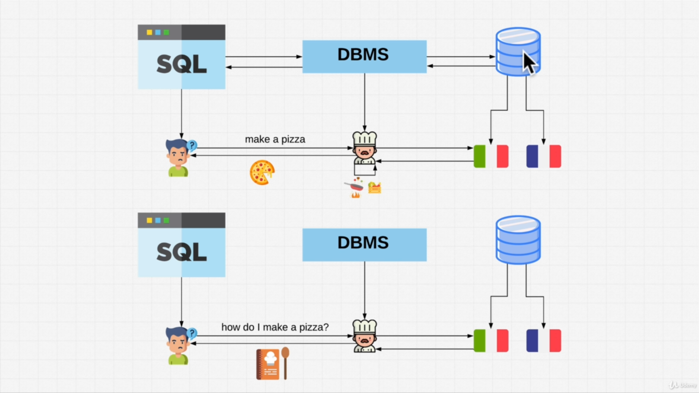
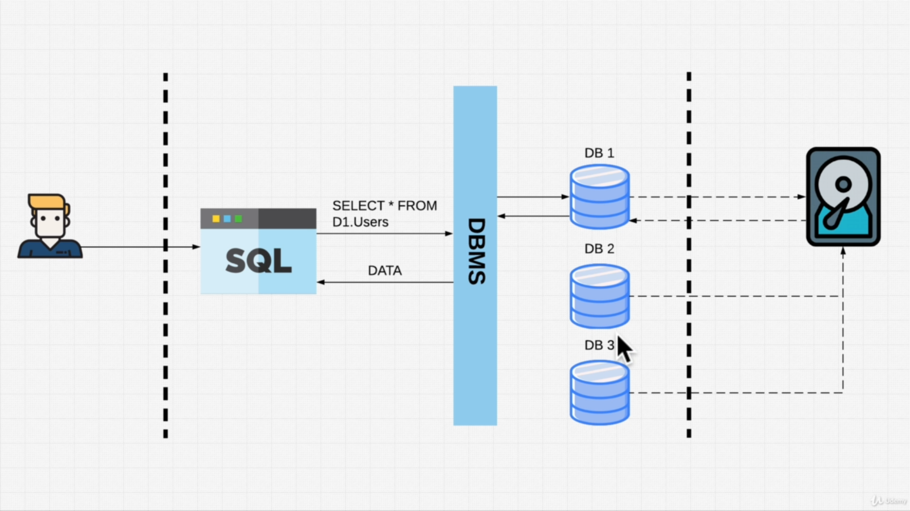

**12 Rules of CODD**
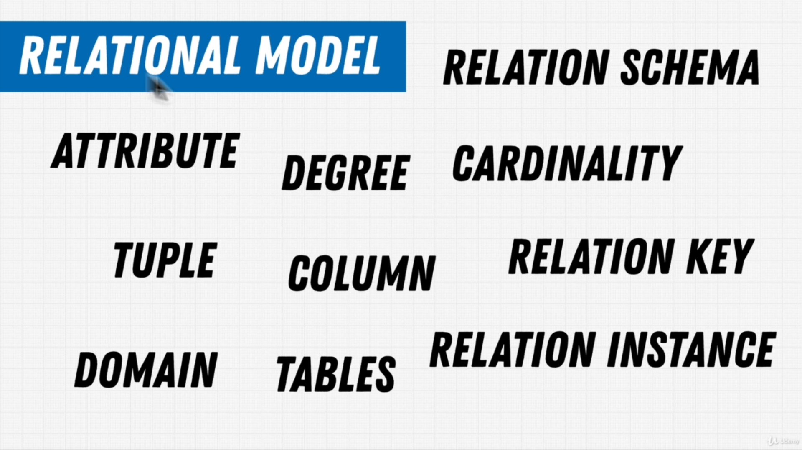
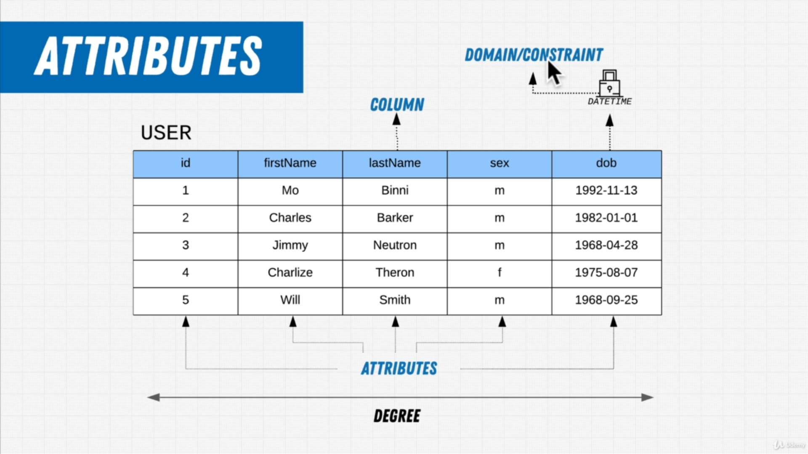
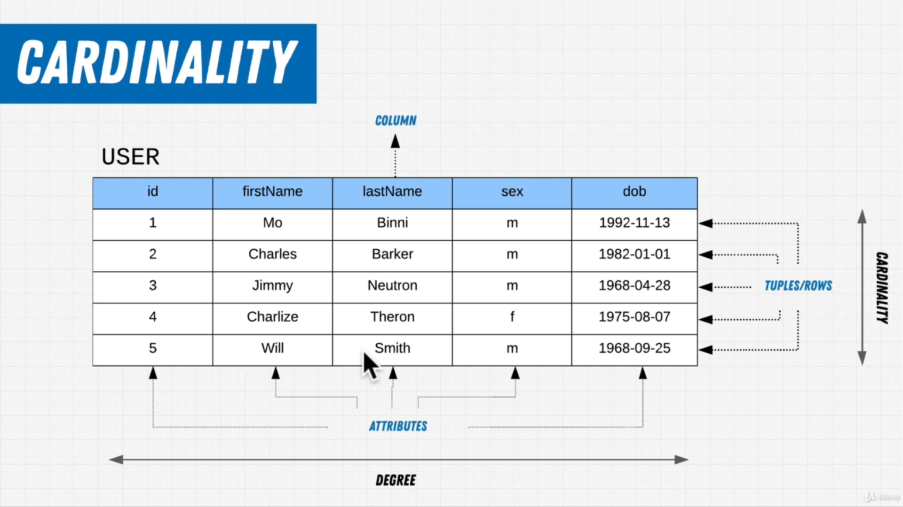
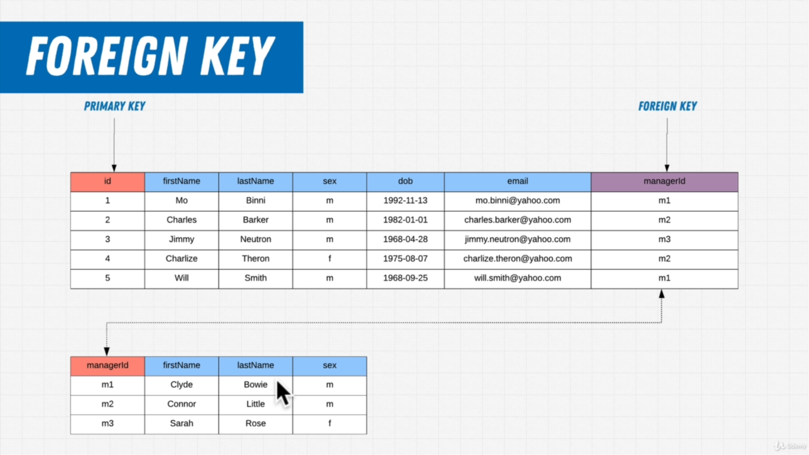

**OLTP**
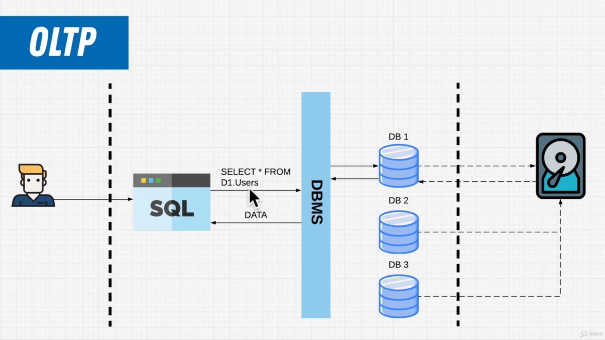
**OLAP**
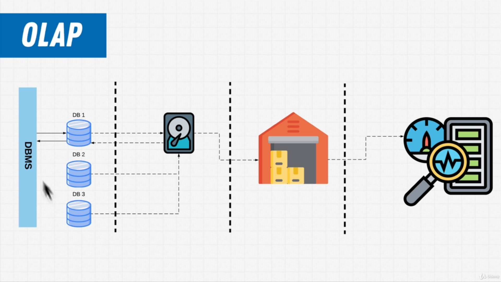

**Comments**
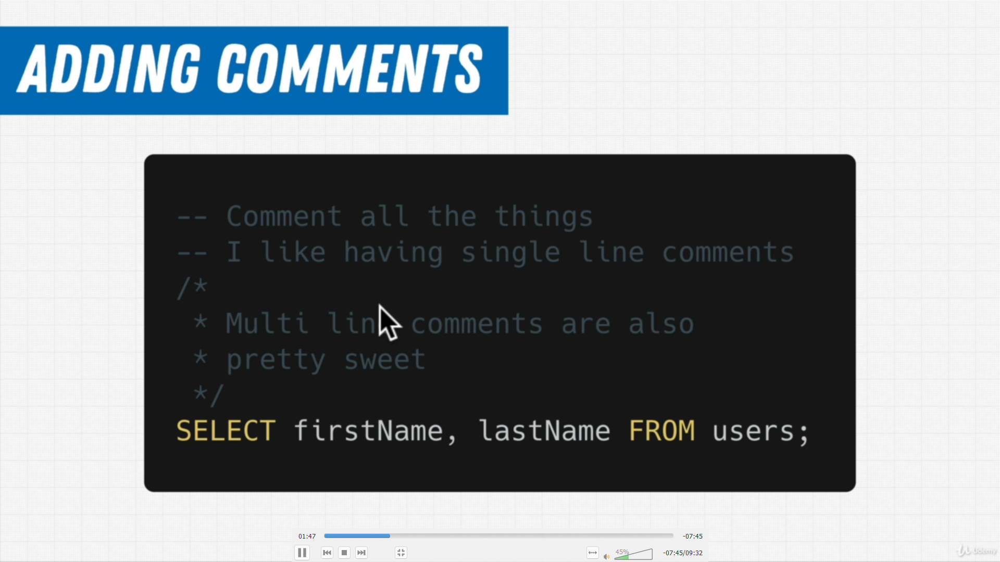