Hash Table Introduction

Hash Functions

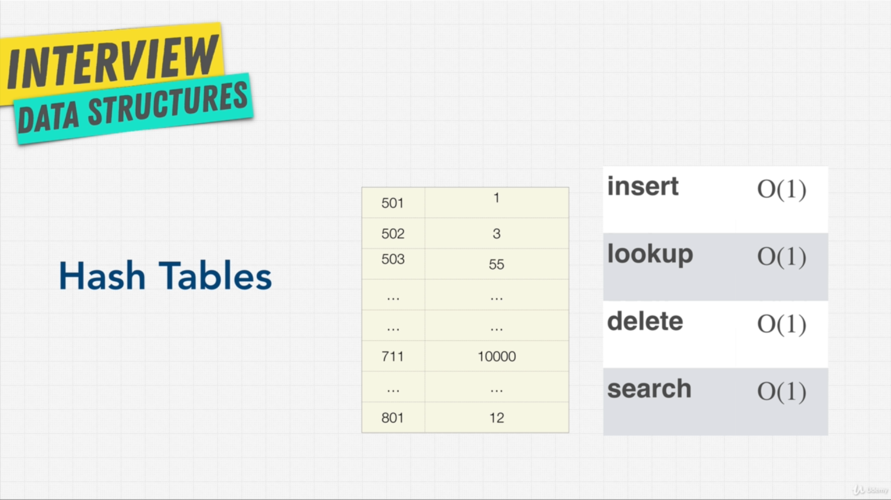

Collision:
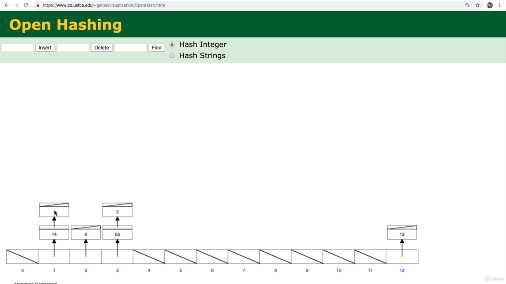
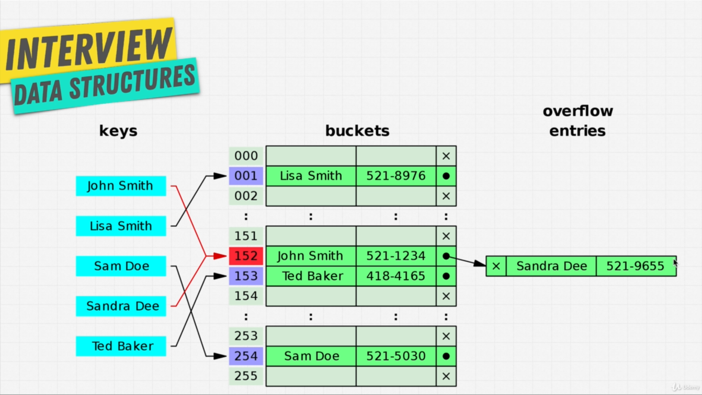

Objects in javascript are stored under the hood by hashing, where keys are always string type,
whereas in Map and Set, we can store the other types as well.
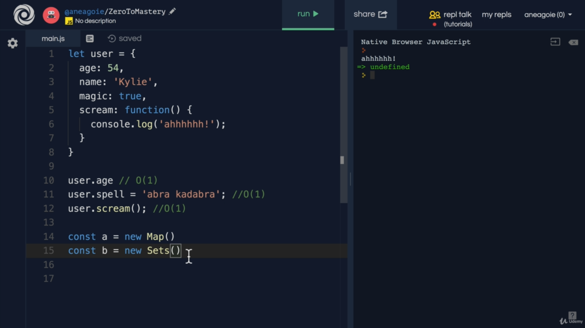

Below is exercise:
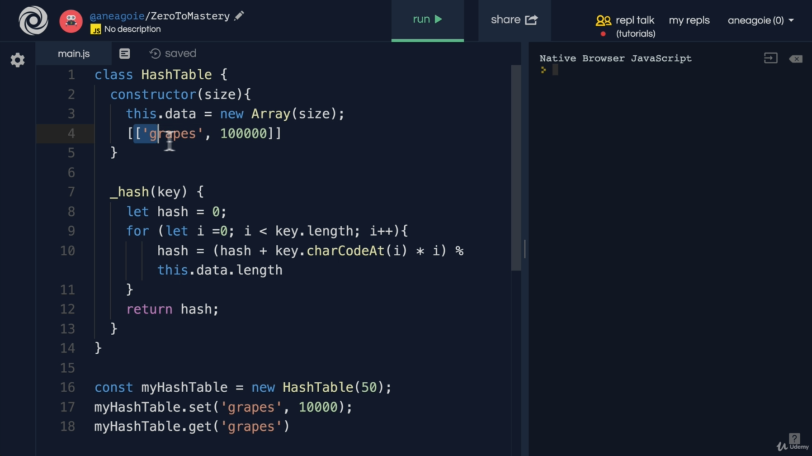

Custom Implementation of Hash Tables in js:
```javascript
class HashTable {
    constructor(size){
        this.data = new Array(size);
    }
    set(key, value)
    {
        let hashIndex = this._hash(key);
        if(!this.data[hashIndex])
        {
            this.data[hashIndex] = [];
        }
        this.data[hashIndex].push([key,value]   );
    }
    get(key)
    {
        let hashIndex = this._hash(key);
        const currentBucket = this.data[hashIndex];
        if(currentBucket)
        {
            for(let i=0; i<currentBucket.length; i++)
            {
                if(currentBucket[i][0] === key)
                {
                    return currentBucket[i][1];
                }
            }
        }
        return undefined;
    }
    //We use _ before the name of the method/attribute as a convention in js to tell other devs
    //that this property is private, although you can access it
    _hash(key) {
        let hash = 0;
        for ( let i=0; i<key.length; i++) {
            hash = (hash + key.charCodeAt(i))% this.data.length;
        }
        return hash;
    }
}
const myHashTable = new HashTable(2);
myHashTable.set('grapes', 10000);
myHashTable.set("apples", 2)
myHashTable.get('grapes');
```

Downside of hashtables, below is how we can fetch all the keys:
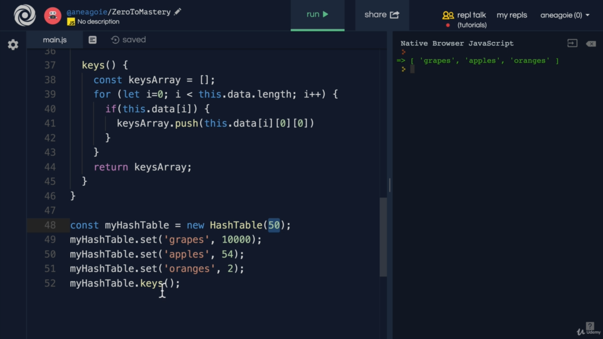

HashTables vs Arrays:
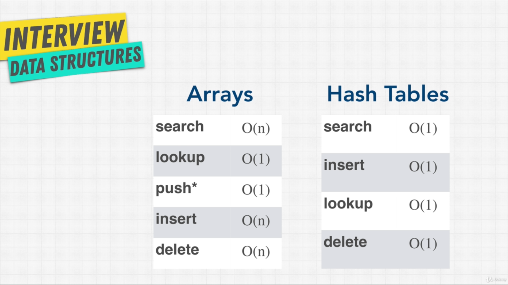

Google question:
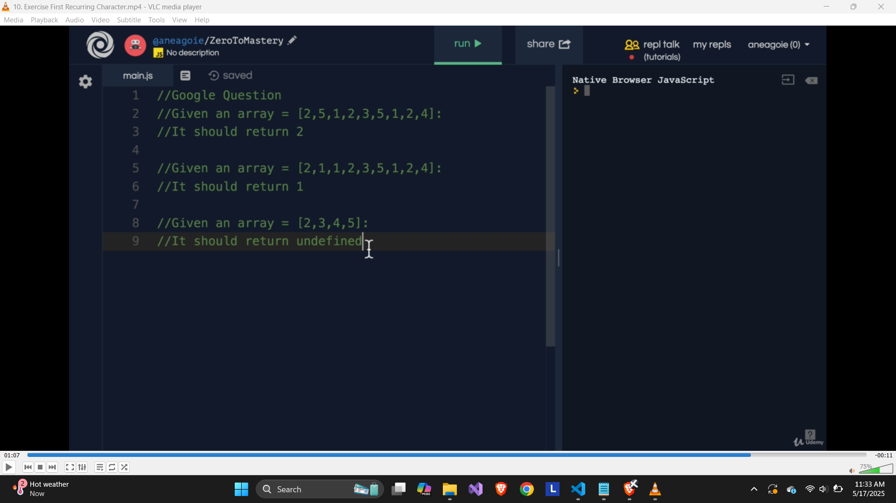

My first attempt
```javascript
class HashTable {
    constructor(size){
        this.data = new Array(size);
    }
    set(key, value)
    {
        let hashIndex = this._hash(key);
        const currentBucket = this.data[hashIndex];
        if(!currentBucket)
        {
            this.data[hashIndex] = [];
        }
        else if(currentBucket)
        {
            let reccurentC = 0;
            for(let i = 0; i < currentBucket.length; i++)
            {
                if(currentBucket[i][0] === key)
                {
                    reccurentC++
                    if(reccurentC>1)
                    {
                        return 0;
                    }
                }
            }
            
            this.data[hashIndex] = [];
            return 1;
        }
        this.data[hashIndex].push([key,value]);
    }
    get(key)
    {
        let hashIndex = this._hash(key);
        const currentBucket = this.data[hashIndex];
        if(currentBucket)
        {
            for(let i=0; i<currentBucket.length; i++)
            {
                if(currentBucket[i][0] === key)
                {
                    return currentBucket[i][1];
                }
            }
        }
        return undefined;
    }
    //We use _ before the name of the method/attribute as a convention in js to tell other devs
    //that this property is private, although you can access it
    _hash(key) {
        let hash = 0;
        for ( let i=0; i<key.length; i++) {
            hash = (hash + key.charCodeAt(i))% this.data.length;
        }
        return hash;
    }
}

const myArray = [2,5,1,2,3,5,2,1,4];
const myHashTable = new HashTable(myArray.length);
for(let i=0;i<myArray.length; i++)
{
    if(!myHashTable.set(myArray[i],myArray[i]))
    {
        console.log(myArray[i]);
    }
}
```

Naive approach:
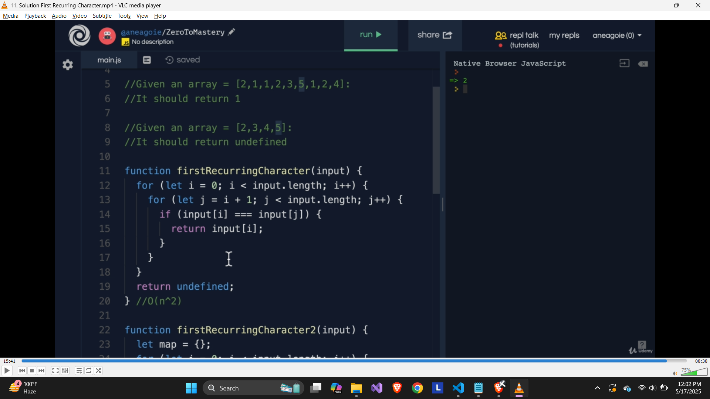
It won't detect the first recurring character rather recurring char linearly

Another approach:
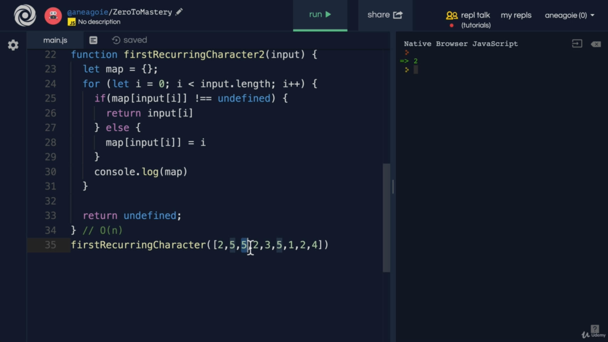

Enhanced naive approach:
```javascript
function firstRecurringCharacter(input) {
  let minIndex = input.length;
  let result;

  for (let i = 0; i < input.length; i++) {
    for (let j = i + 1; j < input.length; j++) {
      if (input[i] === input[j]) {
        if (j < minIndex) {
          minIndex = j;
          result = input[j];
        }
        break; // stop checking after finding first match for input[i]
      }
    }
  }

  return result;
}
```

Enhanced version of my appraoch:
```javascript
class HashTable {
    constructor(size) {
        this.data = new Array(size);
    }

    set(key, value) {
        const hashIndex = this._hash(key);
        if (!this.data[hashIndex]) {
            this.data[hashIndex] = [];
        }

        const currentBucket = this.data[hashIndex];

        for (let i = 0; i < currentBucket.length; i++) {
            if (currentBucket[i][0] === key) {
                // Recurring character found
                return false;
            }
        }

        currentBucket.push([key, value]);
        return true;
    }

    get(key) {
        const hashIndex = this._hash(key);
        const currentBucket = this.data[hashIndex];
        if (currentBucket) {
            for (let i = 0; i < currentBucket.length; i++) {
                if (currentBucket[i][0] === key) {
                    return currentBucket[i][1];
                }
            }
        }
        return undefined;
    }

    _hash(key) {
        let hash = 0;
        const stringKey = key.toString();
        for (let i = 0; i < stringKey.length; i++) {
            hash = (hash + stringKey.charCodeAt(i)) % this.data.length;
        }
        return hash;
    }
}

// Driver code
const myArray = [2, 5, 1, 2, 3, 5, 2, 1, 4];
const myHashTable = new HashTable(myArray.length);

for (let i = 0; i < myArray.length; i++) {
    const inserted = myHashTable.set(myArray[i], myArray[i]);
    if (!inserted) {
        console.log('First recurring:', myArray[i]);
        break;
    }
}
```

Pros and cons:
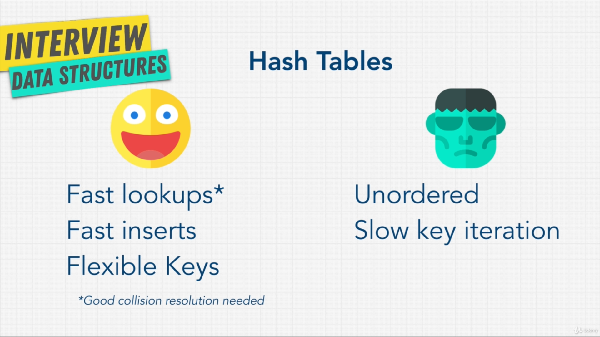