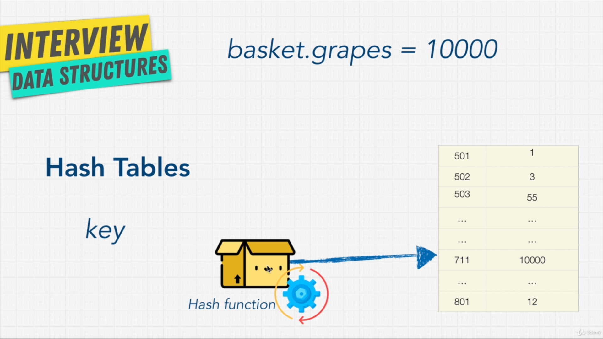

Hash Table Introduction

Hash Functions

Collision:

Objects in javascript are stored under the hood by hashing, where keys are always string type,
whereas in Map and Set, we can store the other types as well.

Below is exercise:
