**Big O**

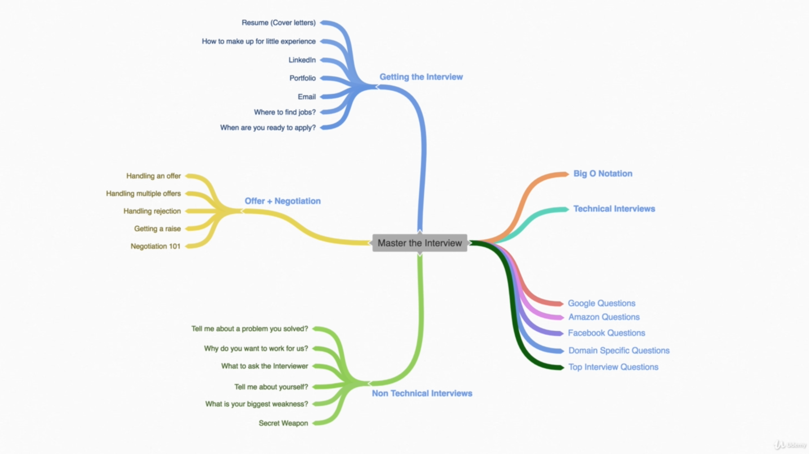
What is a good code?
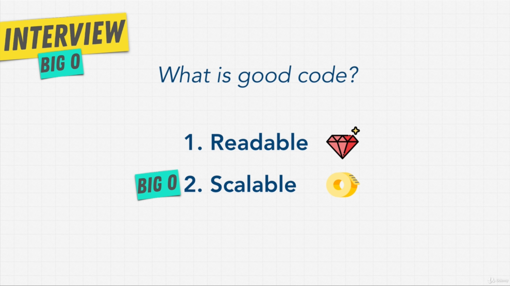

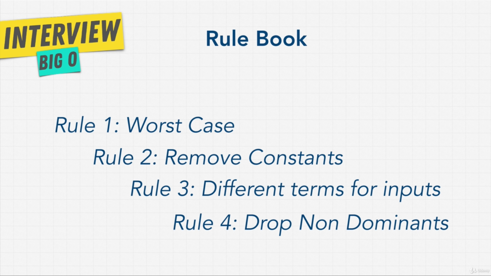
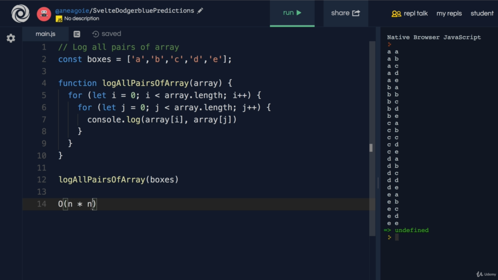
Rule No 3:
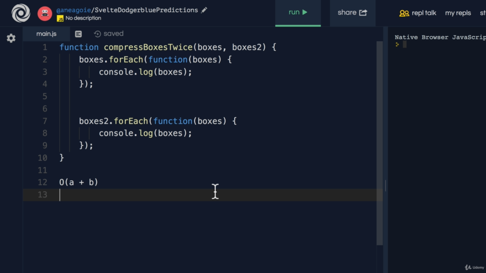

Rule No 4:
We drop the O(n) because O(n^2) is dominant here
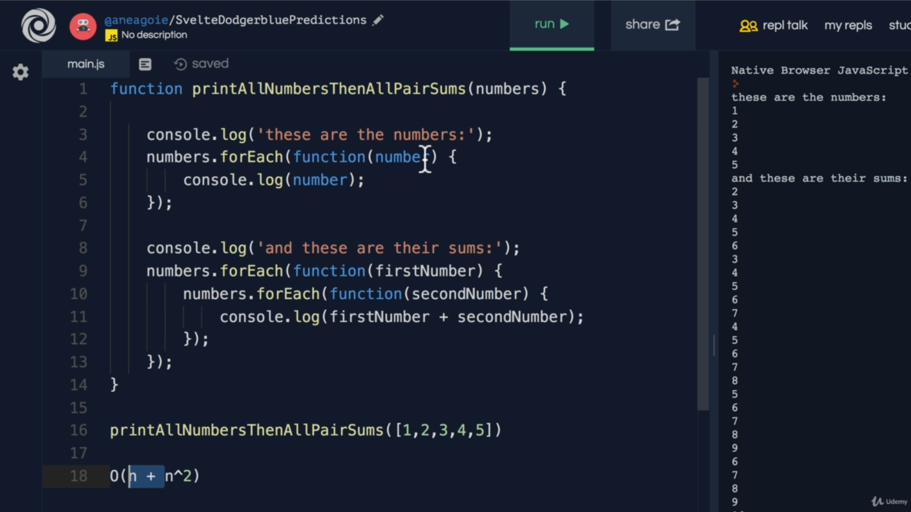
Big O Graph:
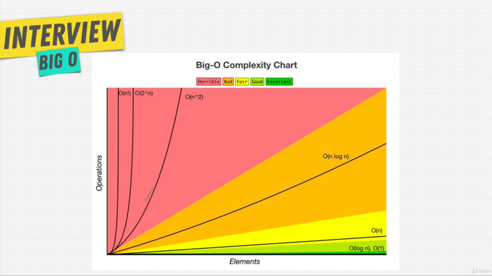

Big O Cheat Sheet:
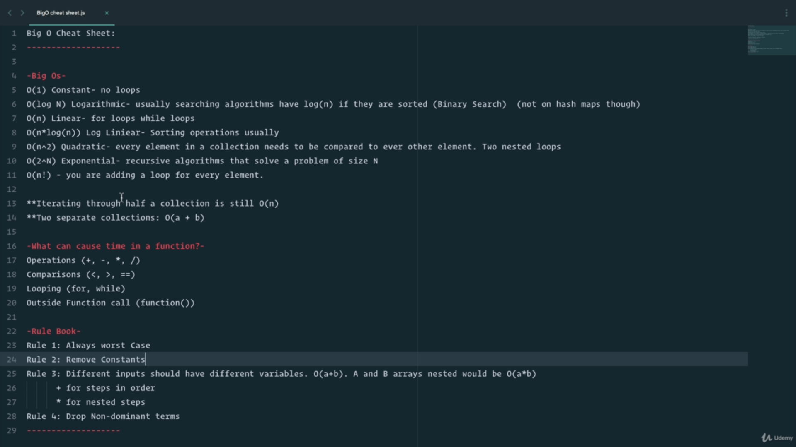
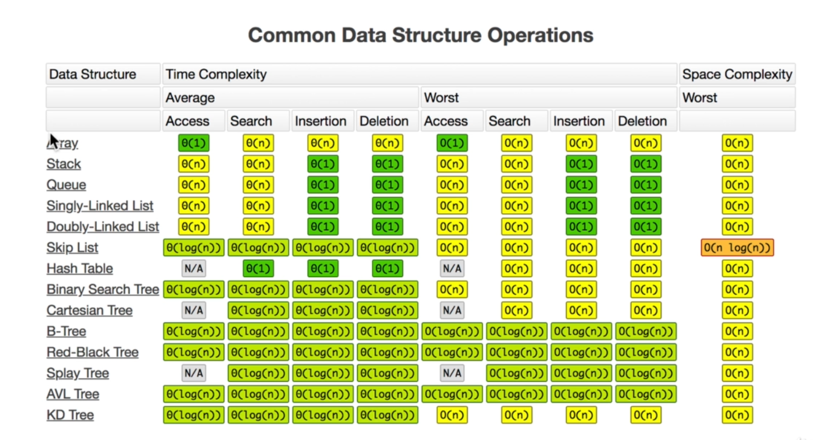

O(n!) example:
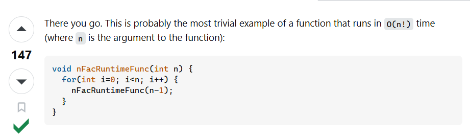

Which code is best?
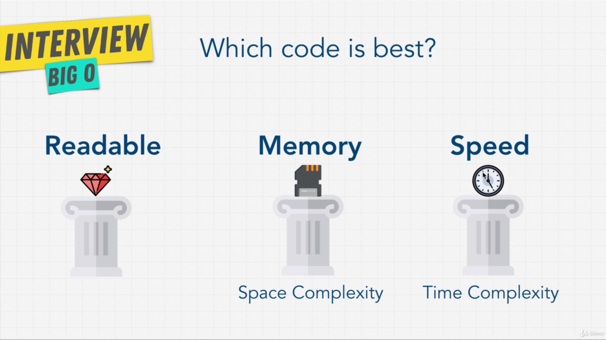

Space Complexity:
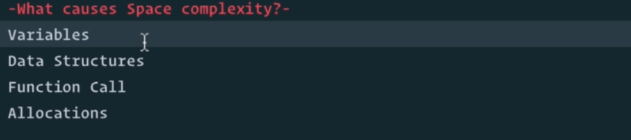
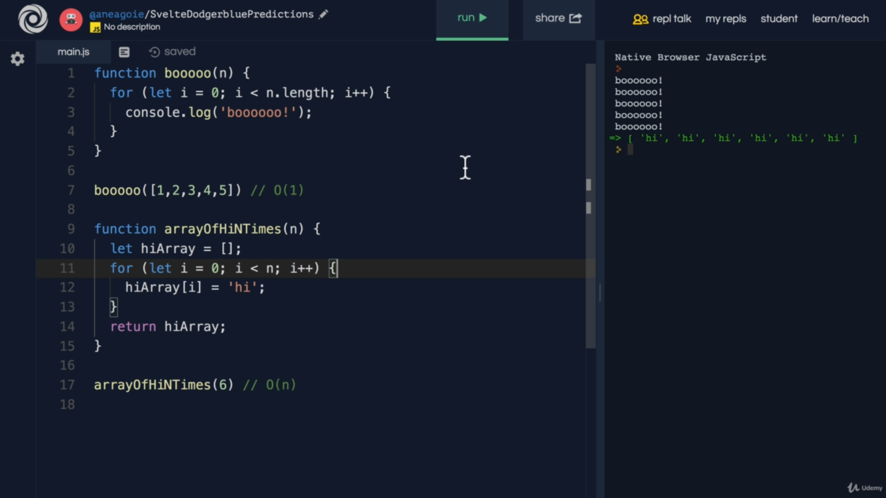