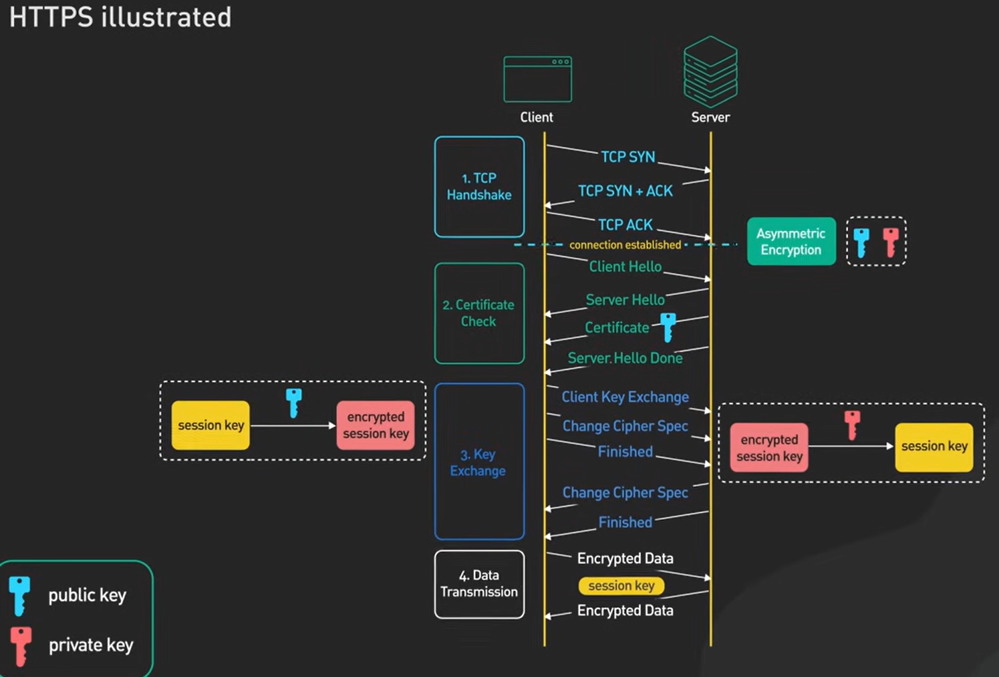
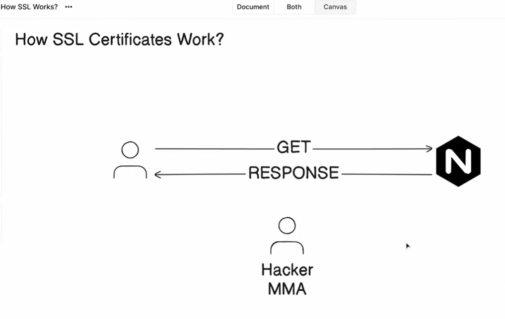
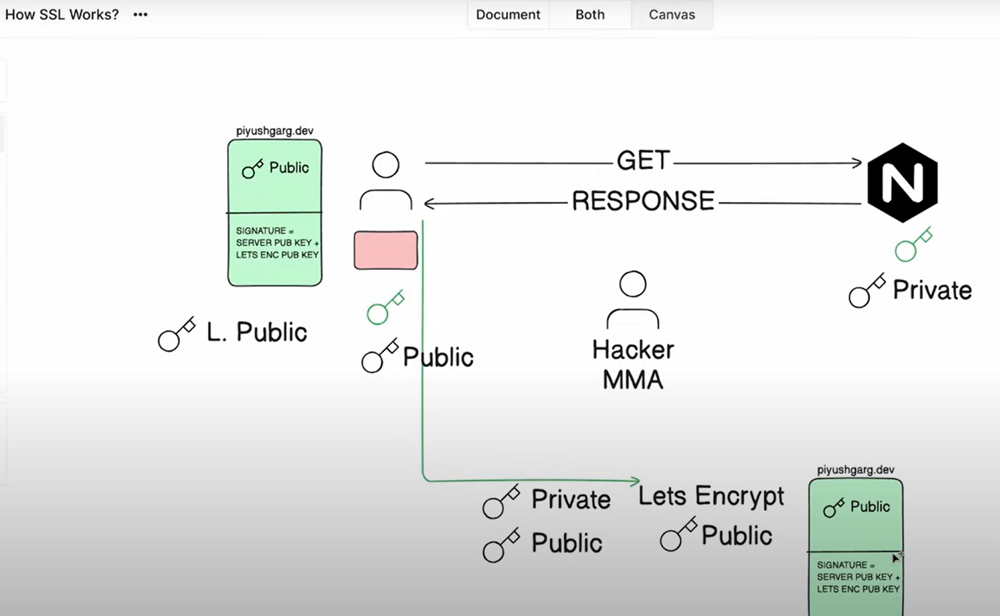

How SSL Certificates Work?


Symmetric Encryption
Same key is used to encrypt and decrypt the data.

Asymmetric Encrption:
Public key and private keys are used in asymmetirc encryption, public key is used to encrypt and private key is used to decrypt.
In asymmetric encryption, the server sends its public key to the client. The client then uses this public key to encrypt a randomly generated session key, which only the server can decrypt with its private key. This session key is then used for fast symmetric encryption for the rest of the communication.


---

### ✅ Recap (Correct Flow):

1. The **server** sends its **public key** to the **client**.
2. The **client** encrypts a session key using the server's **public key** and sends it back.
3. The **server** decrypts it with its **private key**.
4. Both now use the **shared session key** (symmetric encryption) for fast communication.

---

### ⚠️ How a MITM Attack Happens:

Imagine there's an attacker sitting between the **client** and **server**. Here's how they could hijack the communication:

#### **1. Intercept Public Key:**

When the server sends its **public key** to the client, the attacker intercepts it.

#### **2. Substitute Attacker’s Key:**

The attacker then sends **their own public key** to the client — pretending it's the server's.

#### **3. Client Is Tricked:**

The client receives the **attacker’s public key** and unknowingly encrypts the session key with it.

#### **4. Attacker Decrypts and Re-encrypts:**

The attacker:

* Decrypts the session key using their **private key**.
* Re-encrypts it using the real server's **public key**.
* Sends it to the server.

#### **5. Transparent Proxying:**

Now the attacker can:

* Read all data from the client.
* Modify it if desired.
* Forward it to the server.
* And do the same in reverse.

To both the client and the server, everything appears to work fine — but the attacker is **silently intercepting and possibly manipulating** all communication.

---


Let’s dive deeper into the **full lifecycle** of a certificate — from how the **server obtains it**, to **how it’s used**, and **how the client verifies it** — step by step with all technical details.

---

## 📌 1. **How the Server Gets a Certificate from the CA**

### Step 1: **Generate a Public-Private Key Pair**
- The server administrator runs a tool (e.g., OpenSSL) to create:
  - A **private key** (kept secret on the server)
  - A **public key**

```bash
openssl genrsa -out private.key 2048
```

### Step 2: **Create a Certificate Signing Request (CSR)**
- The server generates a **CSR**, which includes:
  - The **public key**
  - **Domain name** (Common Name)
  - **Organization name**
  - **Location info**
  - Optional: Subject Alternative Names (SANs)

```bash
openssl req -new -key private.key -out server.csr
```

### Step 3: **Submit the CSR to a Certificate Authority (CA)**
- The server admin sends the CSR to a **trusted CA** (like DigiCert, Let's Encrypt, etc.).
- The CA performs **validation**:
  - **Domain Validation (DV)**: Confirm server controls the domain (e.g., via DNS record, email, or file upload)
  - Optionally: Organization or Extended Validation

### Step 4: **CA Issues a Signed Certificate**
- If the CA verifies the request, it signs the CSR with **its private key**, creating:
  - A **server certificate** (`server.crt`)
  - It contains:
    - The server’s **public key**
    - Domain name
    - Issuer (the CA)
    - Validity period
    - Digital signature from CA

```bash
# Signed certificate is returned
server.crt
```

---

## 📌 2. **How the Server Sends the Certificate to the Client**

When a client (like a browser) connects to the server via HTTPS:

### Step 1: **TLS Handshake Begins**
- The client says: "Hello, I want to connect securely."

### Step 2: **Server Sends Its Certificate**
The server sends:
- Its **signed certificate** (`server.crt`)
- The **certificate chain** (intermediate certificates if needed)
- *Not* the private key (kept secret)

```text
Server Hello:
- server.crt (includes server’s public key)
- intermediate CA certs
```

---

## 📌 3. **How the Client Verifies the Certificate**

### Step 1: **Check Digital Signature**
- The client extracts the **CA signature** from the server’s certificate.
- It looks up the **CA’s public key** in its list of **trusted root CAs** (preinstalled in the OS/browser).
- Using that public key, it **verifies the signature** to ensure:
  > “This certificate was indeed issued by a trusted CA.”

### Step 2: **Validate Certificate Chain**
- The client builds a **chain of trust**:
  - Server certificate → Intermediate CA → Root CA
- Each certificate must be validly signed by the one above it.

### Step 3: **Validate Certificate Fields**
The client checks:
- ✅ **Domain name** matches the server’s domain (e.g., `www.example.com`)
- ✅ **Validity period** (not expired or not-before date)
- ✅ **Certificate is not revoked** (via CRL or OCSP)

---

## 📌 4. **If All Checks Pass: Secure Connection is Established**

### Step 1: **Client Generates a Session Key**
- A random symmetric session key (for AES, ChaCha20, etc.) is generated.

### Step 2: **Encrypt Session Key with Server’s Public Key**
- The client encrypts it using the **public key** from the server’s certificate.
- Only the server can decrypt it using its **private key**.

### Step 3: **Secure Communication Begins**
- Both now use the shared session key for fast, symmetric encryption.
- The rest of the session is private and encrypted.

---

## 🧠 Summary: End-to-End Flow

```
[Server]
1. Creates key pair (private.key, public.key)
2. Creates CSR with public key & domain
3. Submits CSR to CA
4. Gets signed certificate (server.crt)

[Server → Client]
5. Sends server.crt in TLS handshake

[Client]
6. Verifies CA signature using CA’s public key
7. Validates domain, expiration, revocation
8. Encrypts session key with server’s public key
9. Establishes encrypted session
```

---
