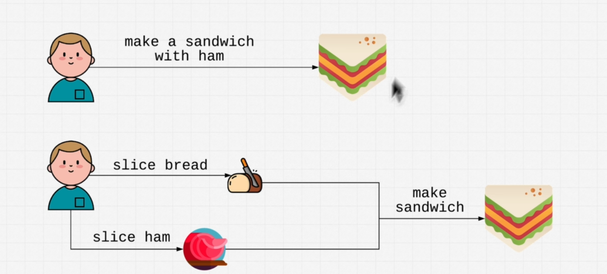
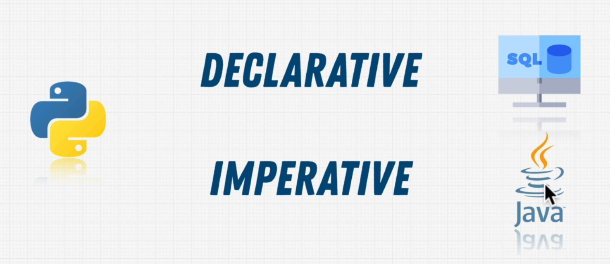

**Declartive vs Imperative Programming languages**
Declartive is what will happen and imperative is how it will happen

below is the real world example

Sql is an declartive, java is imperative while python can be both declartive as well
as imperative
