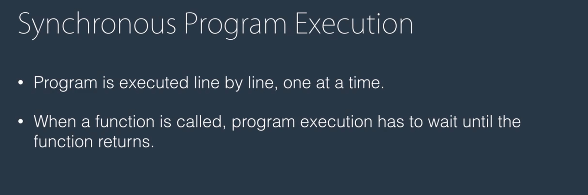
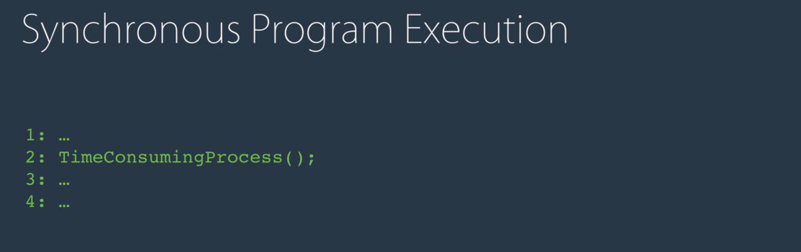
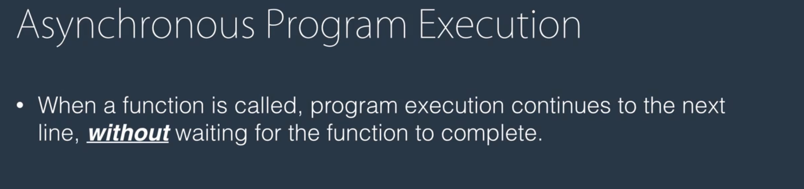
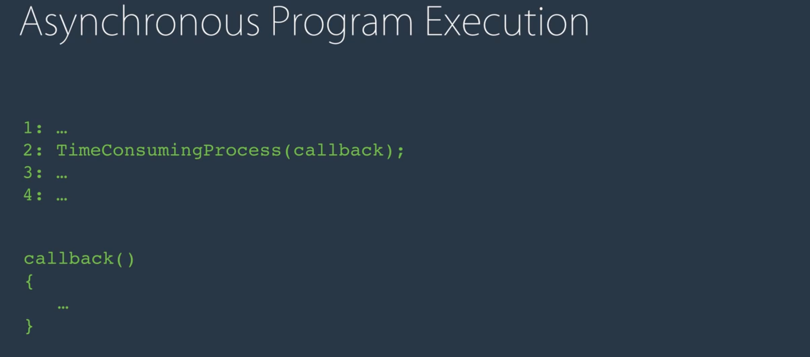
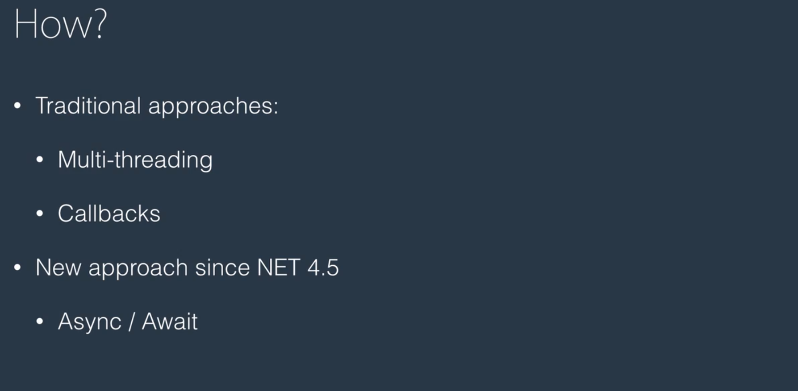
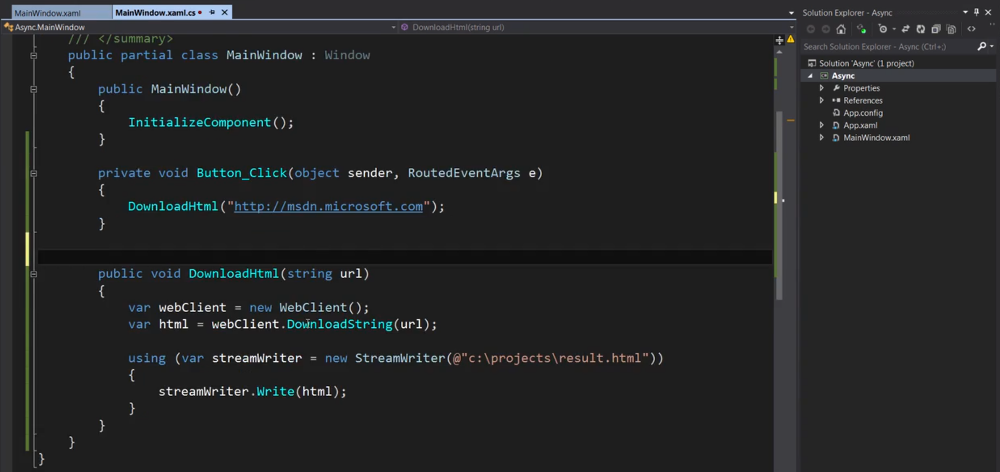
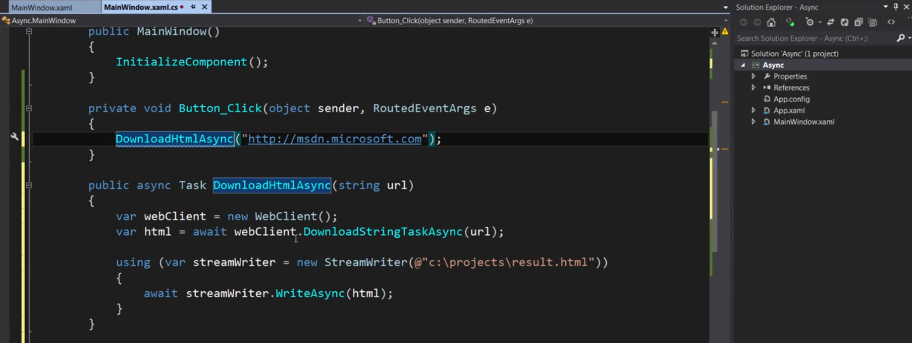
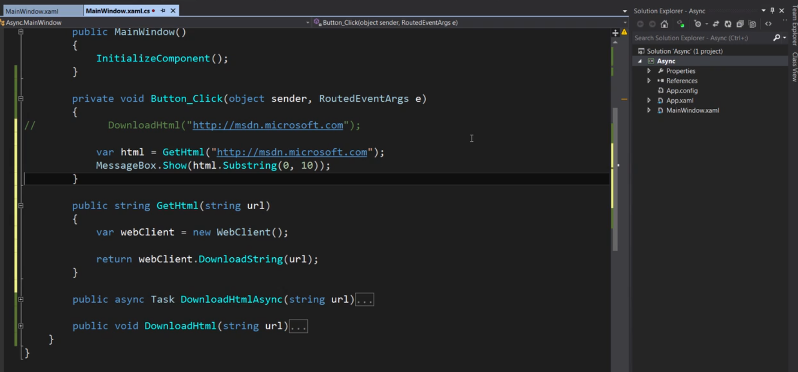
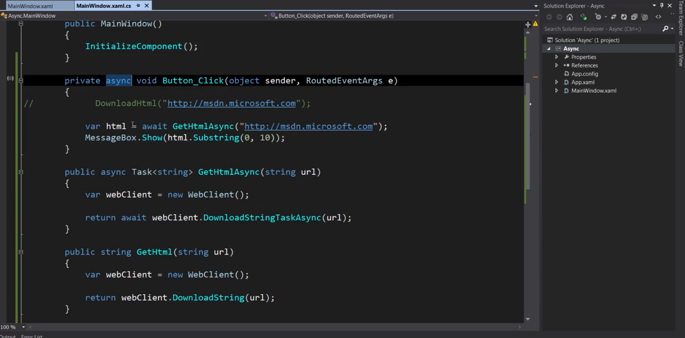
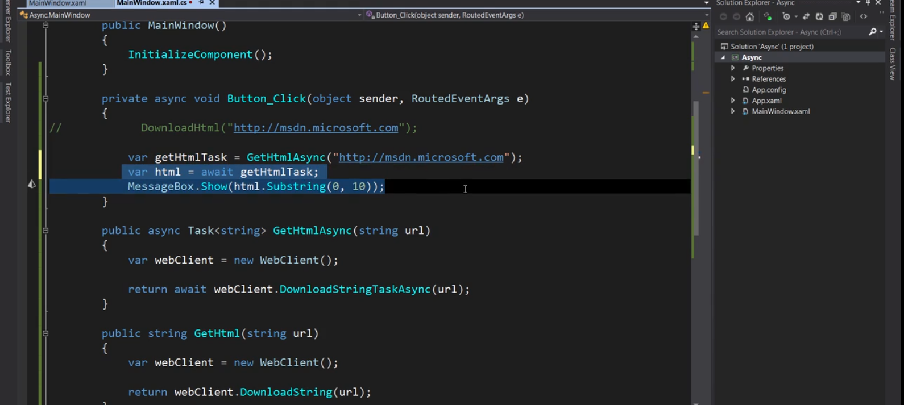

Generic vs Non-Generic Tasks:

Task is non-generic version while `Task<T>` is the genric one.
Below is the example of Sync Programming when the DownloadHtml function is called, UI is blocked and we can't do anything.
After the operation is complete, UI will be unlocked and the user can perform the operations correctly.

Below is the example with async programming, now UI will not be blocked

Lets take an example in which we are going to use the Task which will return string.
Below is the example without async:

and below one is the example with async:

when we are awaiting in the Button_Click getHtmlTask, basically we are telling the compiler to wait for this method to complete 
execution meanwhile UI is responsive and when the result is returned by the GetHtmlAsync, compiler is back to executing
the next statement which is MessageBox.Show(...)

