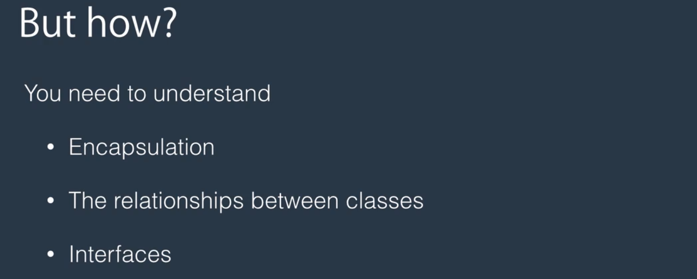
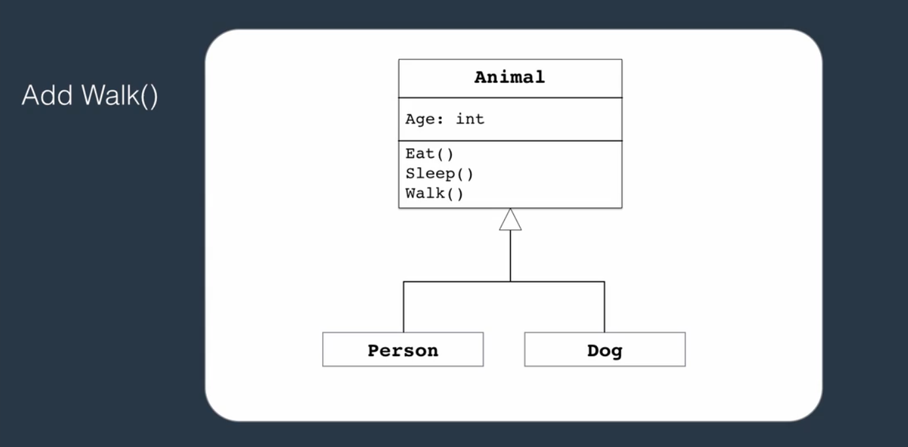

Inheritance

Benefits of Inheritance include: 1->Code re-use 2->Polymorphic behvaviour

Example of inheritance:

UML Representation:

Benefits include:
1->Code re-use
2->Flexibility
3->A means of loose-coupling

Inheritance results in a more tightly coupled relationship whereas Composition gives
more flexibility with loose-coupling

We can replace the Animal class with an interface in Composition

Read the 5. Summary.pdf for summary