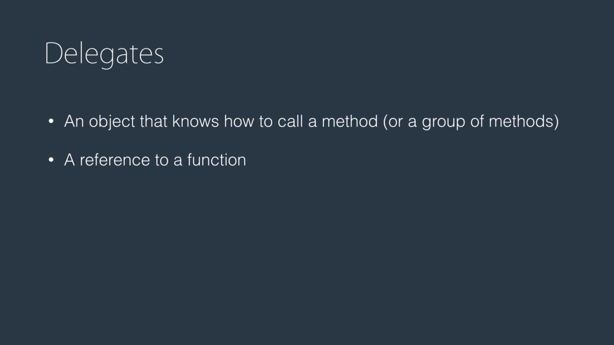

---

## 🖼️ Building a Flexible Image Processing Framework in C#

When developing applications that handle images—applying filters like brightness, contrast, resizing, or red-eye removal—maintaining **flexibility and scalability** is essential. This article walks through how an initially rigid image processing pipeline can be evolved into a **flexible, reusable system** using **delegates**, and how we can take it further using **built-in .NET types** or even **interfaces**.

---

## ✅ Initial Design: Hardcoded Filter Chain

We start with a simple approach where the filters are **tightly coupled** inside a processing class.

```csharp
namespace Delegates;

public class Photo
{
    public static Photo Load(string path) => new Photo();
    public void Save() { }
}

public class PhotoFilters
{
    public void ApplyBrightness(Photo photo) => Console.WriteLine("Applying Brightness...");
    public void ApplyContrast(Photo photo) => Console.WriteLine("Applying Contrast...");
    public void Resize(Photo photo) => Console.WriteLine("Resizing...");
}

public class PhotoProcessor
{
    public void Process(string path)
    {
        var photo = new Photo();
        var filters = new PhotoFilters();
        filters.ApplyBrightness(photo);
        filters.ApplyContrast(photo);
        filters.Resize(photo);
        photo.Save();
    }
}
```

### 🔍 What's wrong here?

- **Lack of flexibility**: Every time you want to change the filter order or add a new one, you need to modify the `Process` method.
- **Hard to extend**: You can’t inject or remove filters without changing the source code.

---

## ✅ Refactor 1: Using a Custom Delegate

We introduce a **custom delegate** to decouple filter methods from the processor.

```csharp
public class PhotoProcessor
{
    public delegate void PhotoFilterHandler(Photo photo);

    public void Process(string path, PhotoFilterHandler filterHandler)
    {
        var photo = new Photo();
        filterHandler(photo);
        photo.Save();
    }
}
```

Now in the `Main` method, filters can be composed **dynamically**:

```csharp
public static void Main()
{
    var processor = new PhotoProcessor();
    var filters = new PhotoFilters();

    PhotoProcessor.PhotoFilterHandler filterHandler = filters.ApplyBrightness;
    filterHandler += filters.ApplyContrast;
    filterHandler += filters.Resize;
    filterHandler += RemoveRedEyeFilter;

    processor.Process("image.jpeg", filterHandler);
}

static void RemoveRedEyeFilter(Photo photo)
{
    Console.WriteLine("RemoveRedEyeFilter...");
}
```

### ✅ Benefits

- 🧩 **Open for extension**: Add filters without modifying `PhotoProcessor`.
- 🔁 **Reusable pipeline**: The same processor works with any combination of filters.

---

## ✅ Refactor 2: Using .NET's Built-in `Action<T>`

Instead of declaring a custom delegate, use .NET’s built-in **`Action<Photo>`**, which represents any method that takes a `Photo` and returns void.

```csharp
public class PhotoProcessor
{
    public void Process(string path, Action<Photo> filterHandler)
    {
        var photo = new Photo();
        filterHandler(photo);
        photo.Save();
    }
}
```

Usage becomes even more concise:

```csharp
Action<Photo> filterHandler = filters.ApplyBrightness;
filterHandler += filters.ApplyContrast;
filterHandler += filters.Resize;
filterHandler += RemoveRedEyeFilter;
```

### 👍 Why use `Action<Photo>`?

- ✅ Built-in and more expressive.
- ✅ No need to define and maintain a custom delegate type.
- ✅ Works well with lambda expressions and anonymous methods.

---

## 💡 Bonus: Using Interfaces Instead of Delegates

In some scenarios, especially when filters have more logic or need to hold state, you might want to use interfaces:

```csharp
public interface IPhotoFilter
{
    void Apply(Photo photo);
}

public class BrightnessFilter : IPhotoFilter
{
    public void Apply(Photo photo)
    {
        Console.WriteLine("Applying Brightness...");
    }
}
```

Then use a list of filters:

```csharp
var filters = new List<IPhotoFilter>
{
    new BrightnessFilter(),
    new ContrastFilter(),
    new ResizeFilter()
};

foreach (var filter in filters)
{
    filter.Apply(photo);
}
```

### When to use interfaces?

- When filters need **configuration or state**.
- When filters are **more complex** than a simple method call.
- When you want to take advantage of **dependency injection**.

---

## 🧠 Final Thoughts

| Approach             | Flexibility | Simplicity | Reusability | Best Use Case                                |
|----------------------|-------------|------------|-------------|----------------------------------------------|
| Hardcoded Filters     | ❌          | ✅         | ❌          | Quick-and-dirty prototypes                   |
| Custom Delegates      | ✅          | 🔁         | ✅          | Learning phase or when you need more control |
| `Action<Photo>`       | ✅✅         | ✅✅        | ✅✅         | Most common & recommended in real-world apps |
| Interface-based       | ✅✅         | 🔁         | ✅✅         | Complex filter logic with custom behavior    |

By evolving from tightly coupled filters to a delegate- or interface-driven system, your code becomes cleaner, more maintainable, and easier to extend.

---
