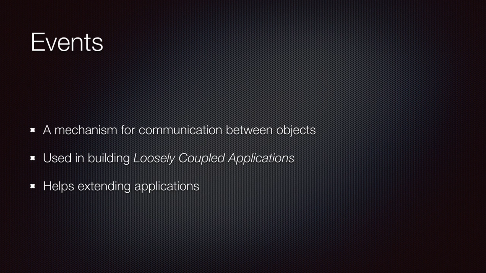

Say we want to send text to someone after the video encoding, we need to add that functionality
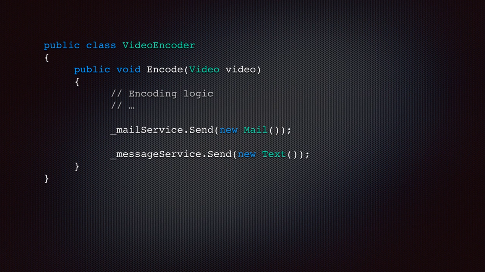
Now we have added the new code in the VideoEncode class and code need to be recompiled again. 
And that means all the classes that are dependent on VideoEncoder need to be recompiled 
and deployed again.

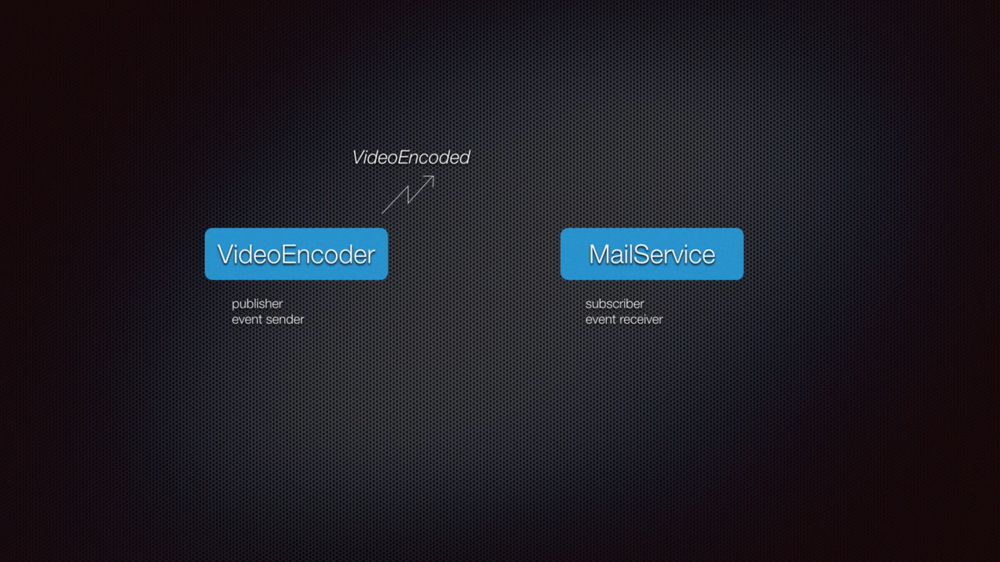
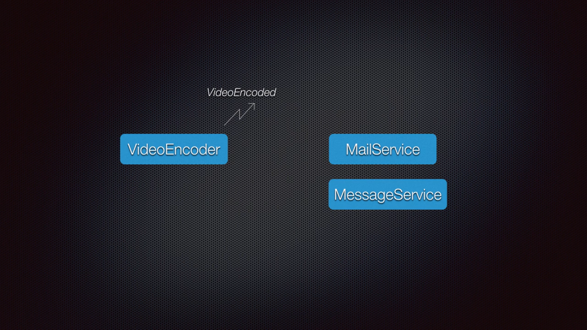
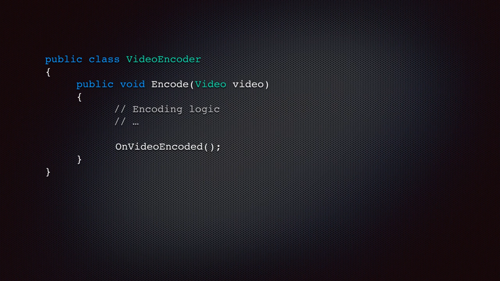
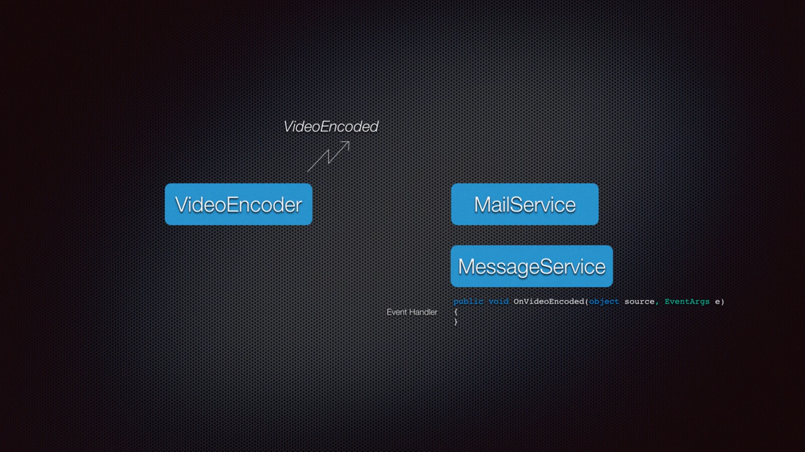
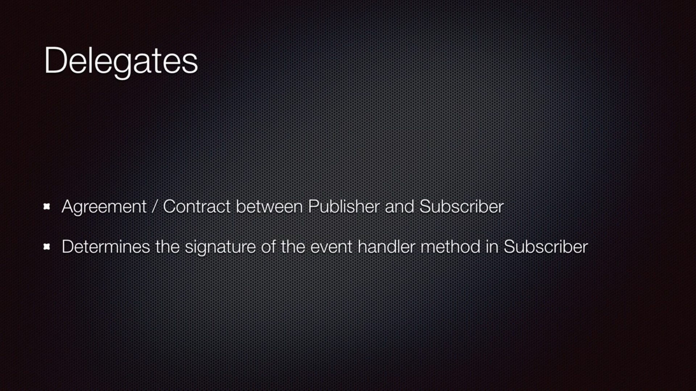

Example
Video.cs
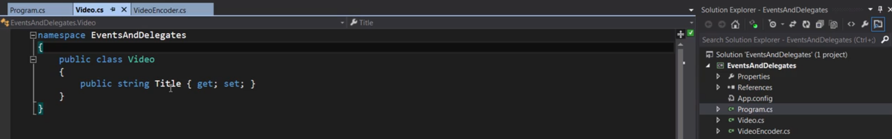

VideoEncoder.cs
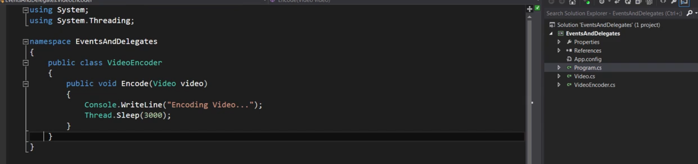

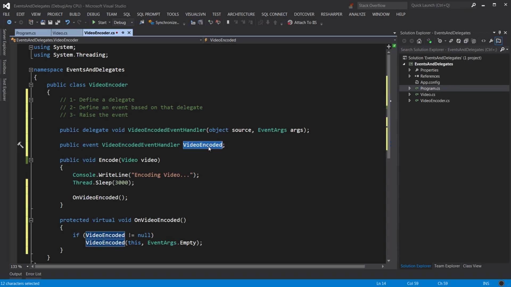

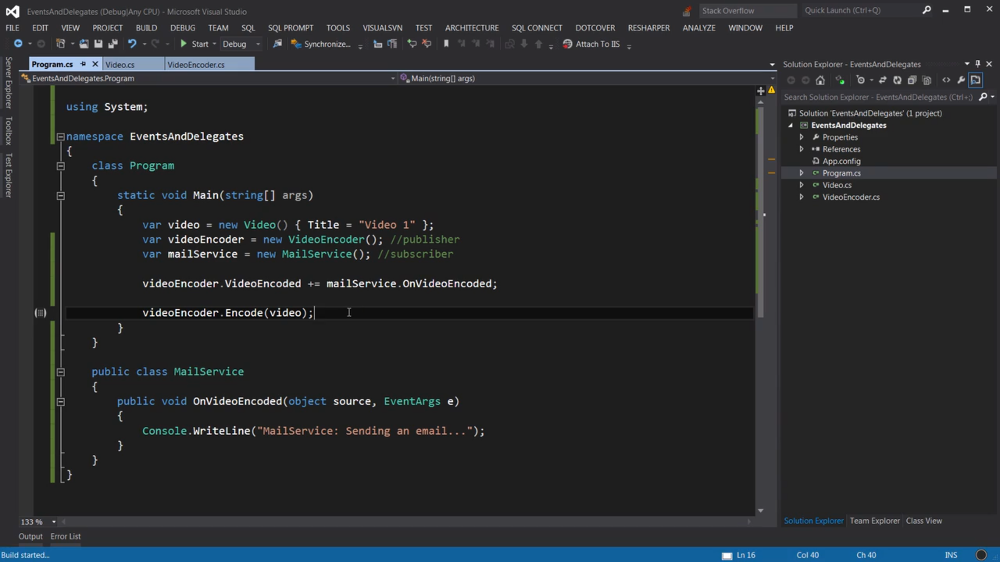
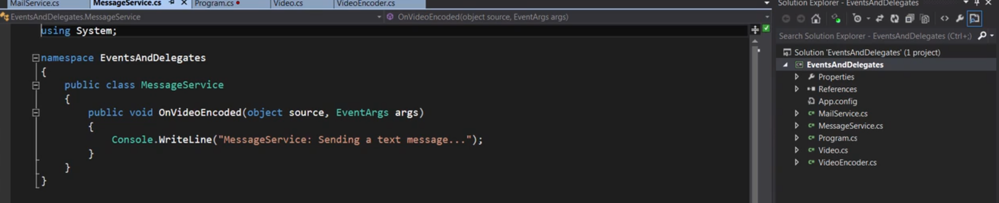
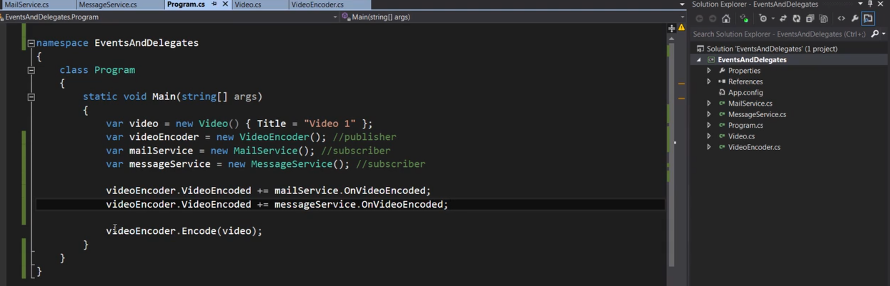

Another version of the event to send the video going to be encoded
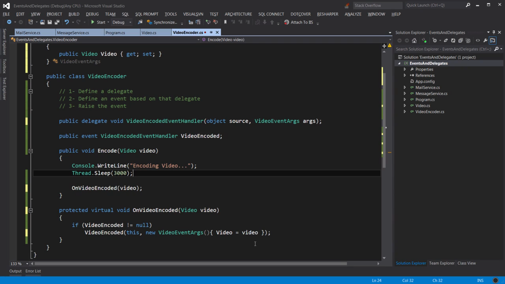
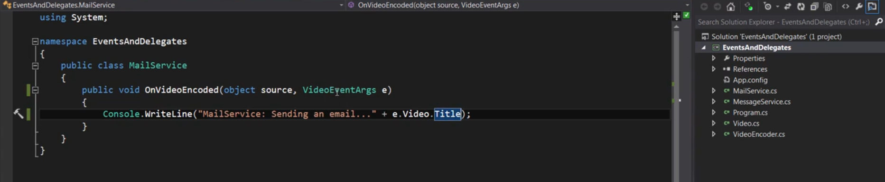

Built in method in csharp for event:
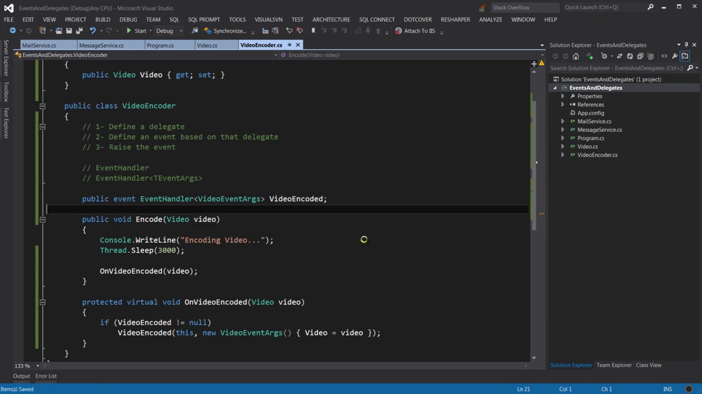