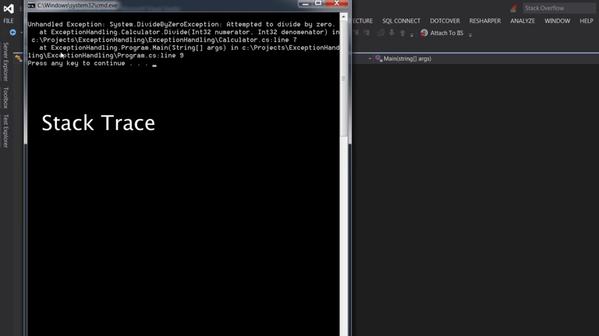

Great! Let's first **explain what a stack trace is**, and then show a clean example of a divide-by-zero error **without a try-catch block**, so you can see the raw, unhandled exception output.

---

### ✅ What is a **Stack Trace**?

A **stack trace** is a report of the **active stack frames** at a certain point in time during the execution of a program—typically when an **exception** is thrown.

It tells you:

* **What exception occurred**
* **Where it occurred** (line number, method, and file)
* **The sequence of method calls** that led to the error

Each entry in the stack trace represents a **method call**. The **topmost** line is where the exception actually occurred. The lines beneath it show the call stack: how the program got there.

---

### 🔧 **C# Example (No Try-Catch Block)**

```csharp
using System;

class Program
{
    static void Main(string[] args)
    {
        int result = Divide(10, 0);  // This will cause a DivideByZeroException
        Console.WriteLine($"Result: {result}");
    }

    static int Divide(int a, int b)
    {
        return a / b;
    }
}
```

---

### 💥 Output (Unhandled Exception and Stack Trace):

```plaintext
Unhandled exception. System.DivideByZeroException: Attempted to divide by zero.
   at Program.Divide(Int32 a, Int32 b) in C:\Projects\Program.cs:line 12
   at Program.Main(String[] args) in C:\Projects\Program.cs:line 7
```

---

### 🔍 Stack Trace Breakdown:

| Stack Frame                           | Meaning                                                |
| ------------------------------------- | ------------------------------------------------------ |
| `at Program.Divide(Int32 a, Int32 b)` | The error occurred here when trying to divide 10 by 0. |
| `in Program.cs:line 12`               | The exact file and line number where it happened.      |
| `at Program.Main(String[] args)`      | The Divide method was called from `Main`.              |
| `in Program.cs:line 7`                | The call happened at line 7 of the source file.        |

This is extremely helpful for debugging because it tells you **the root cause and call path** that led to the crash.

