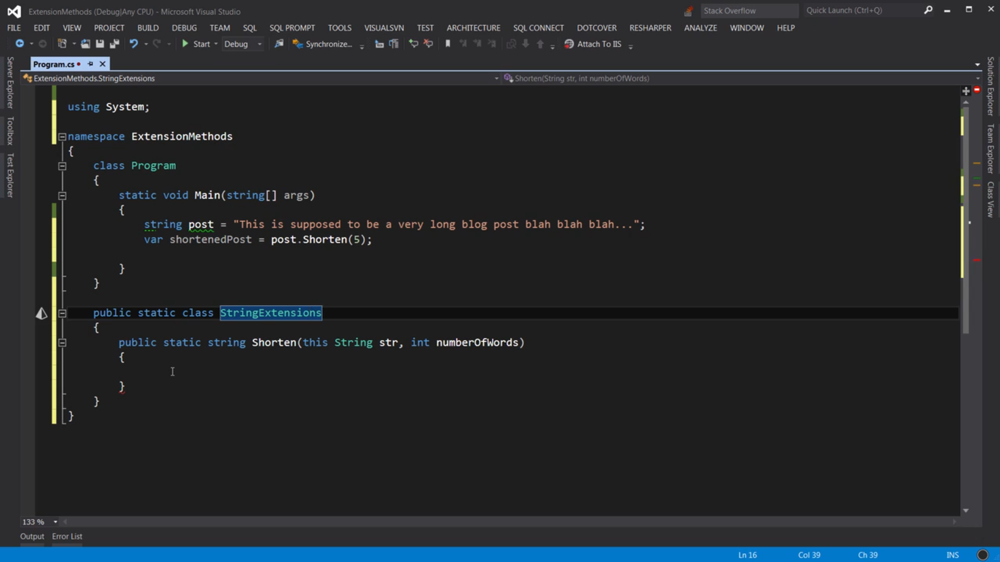
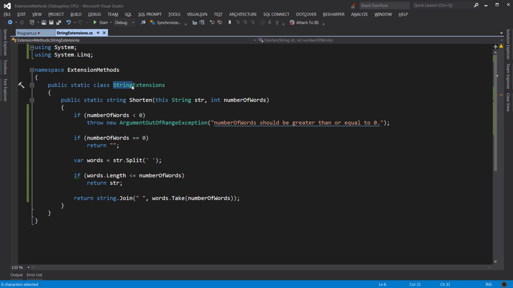
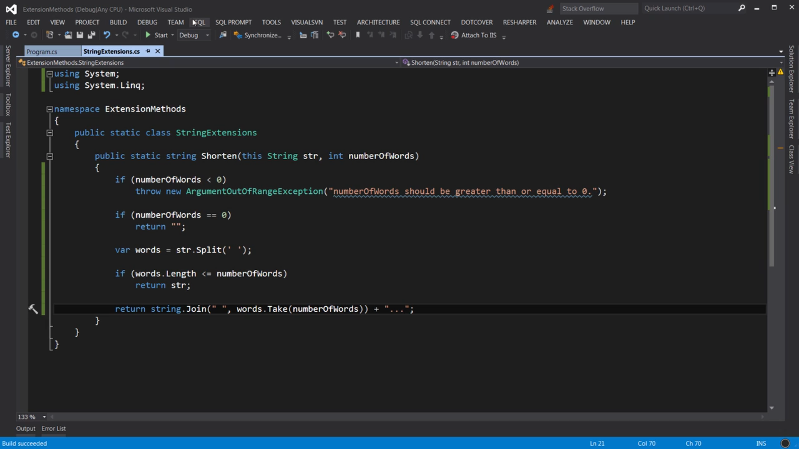
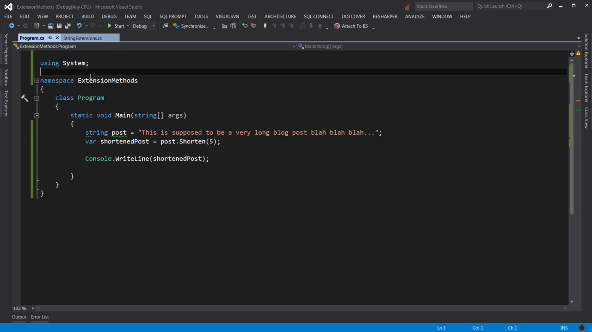
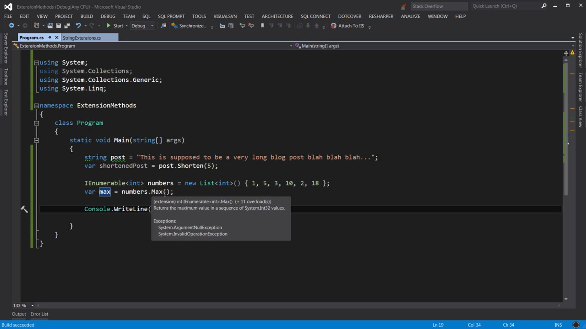

Final:

Because String class is defined in the System namespace, we can define its extension methods in the same namespace

In most of the cases, we would be using extension methods rather than creating them
