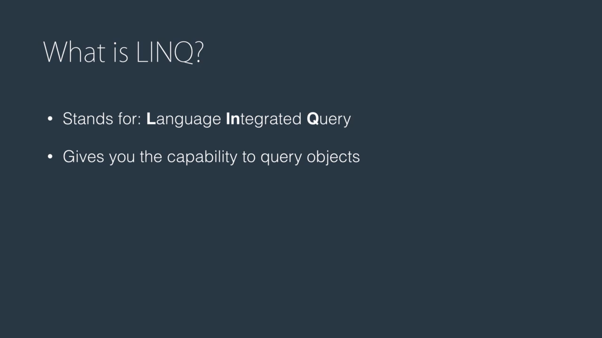
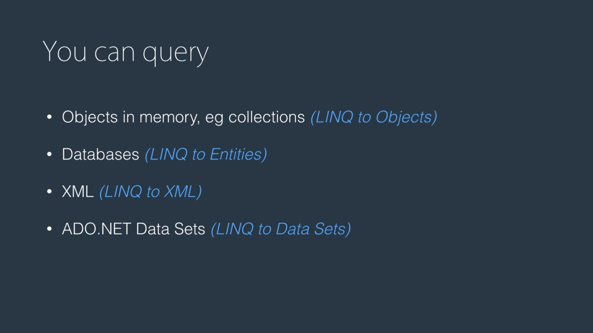

Example:
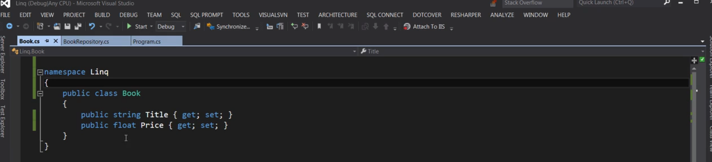

BookRepository:
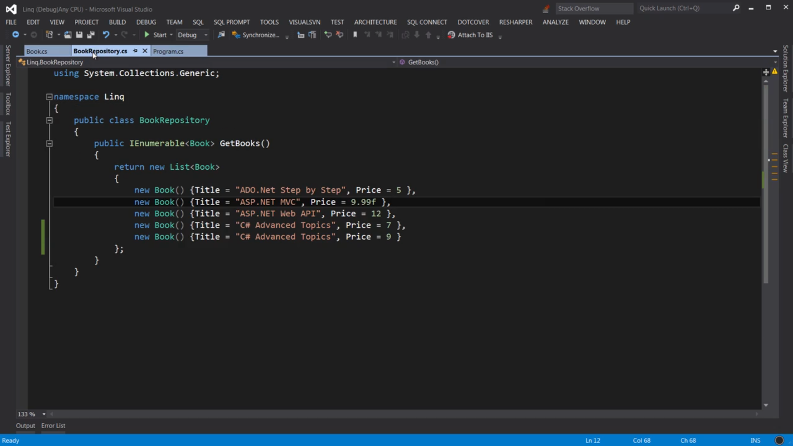
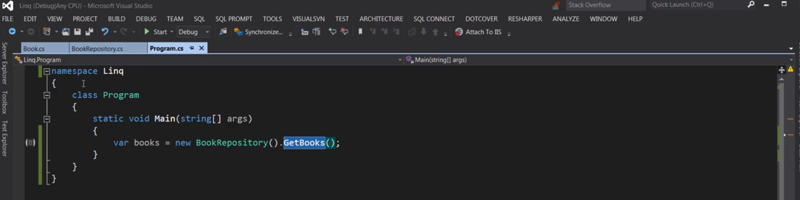

Without LINQ, below is how we would query to find the cheaper books:
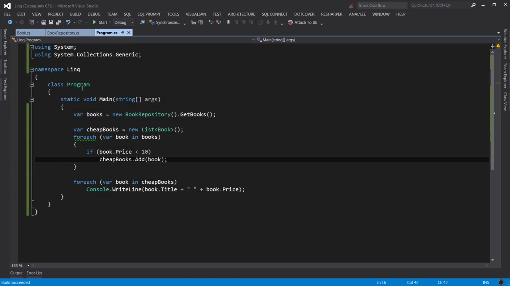
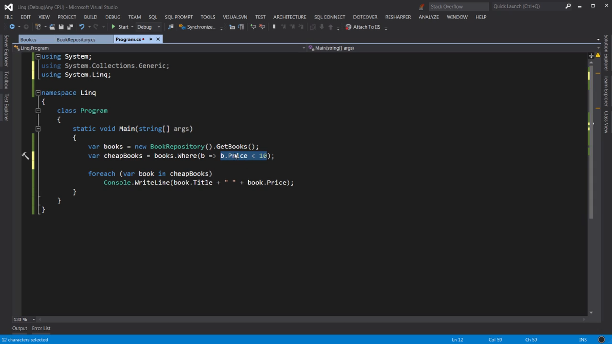

Different features of linq:
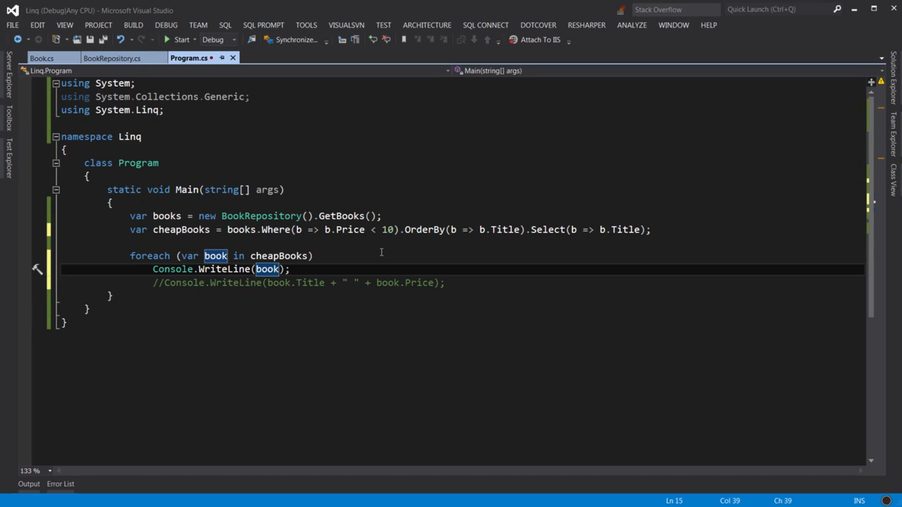
Different ways to write linq
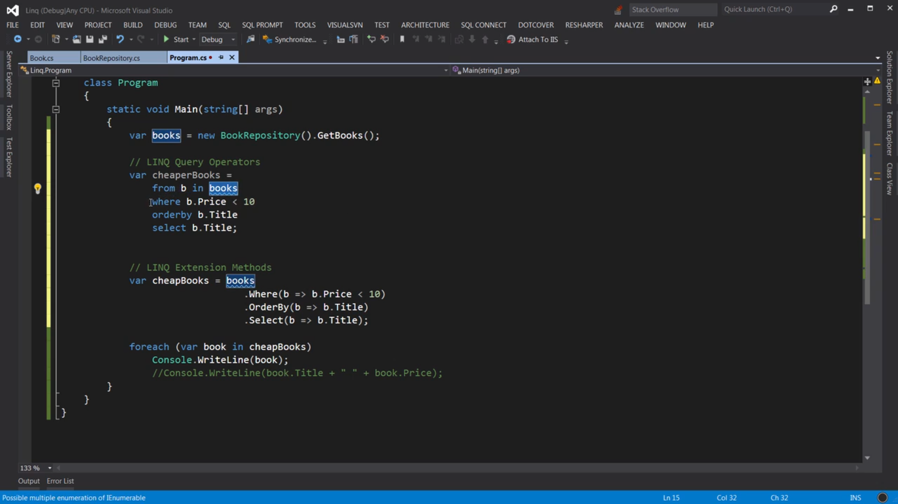

Single expects one result to be present in the list but if none is present it will thorw an exception:
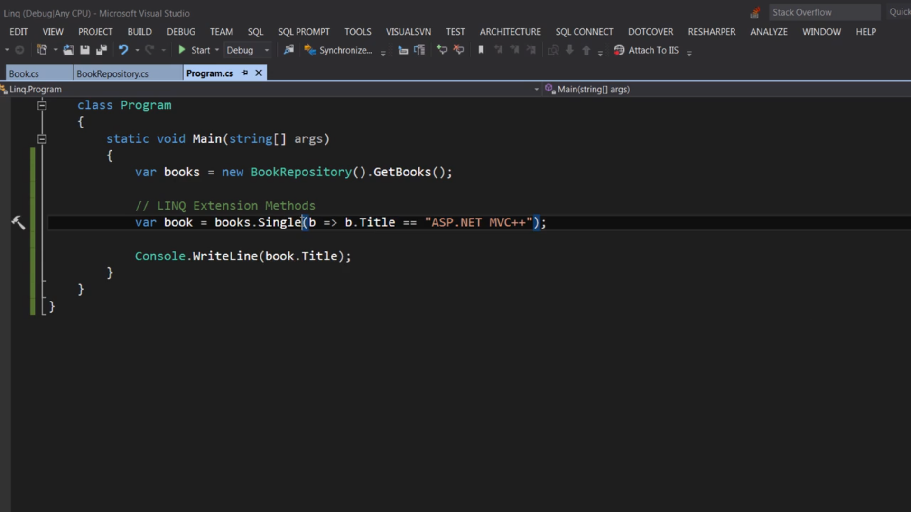

So we use default when we know in advance there might not be a single result matching the criteria:
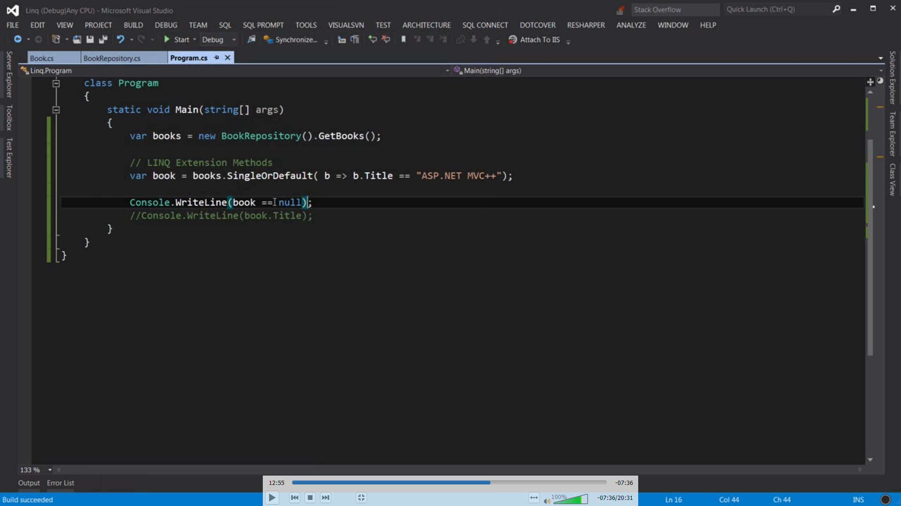

Give me first book whose title matches the criteria given in the where clause:
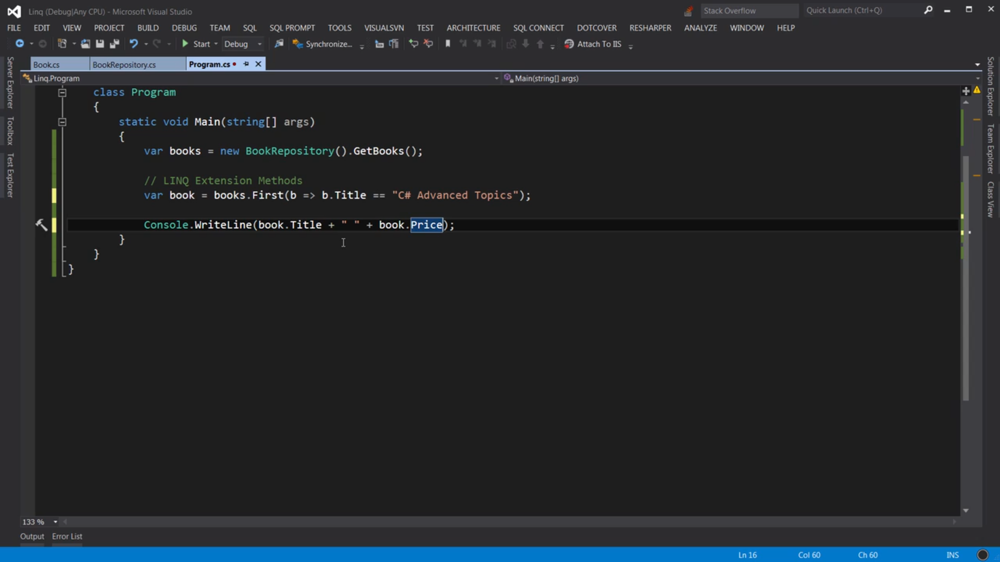
Similary we have FirstOrDefault which works the same way as SingleOrDefault

Below is how we can skip the first two records and grab the other three:
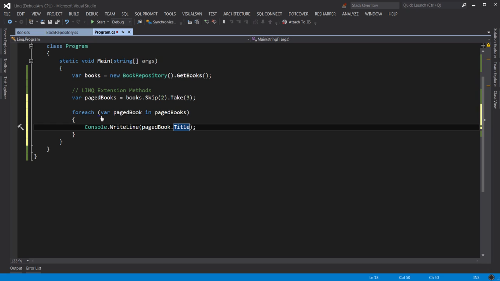

Methods for reference:
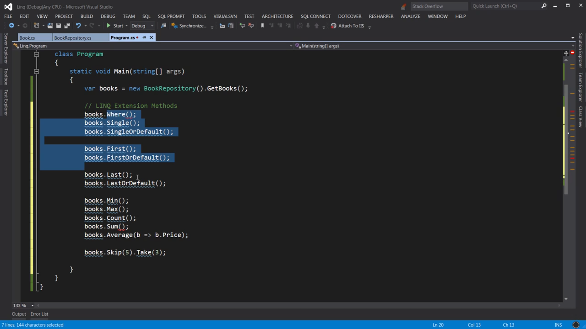