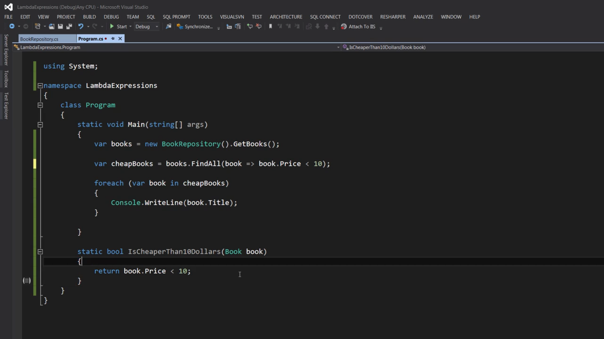

The image shows a C# code example demonstrating Lambda Expressions. Let me break down the code:

```csharp
Func<int, int> square = number => number*number;
```
This line demonstrates:
- `Func<int, int>` is a delegate type that takes an integer input and returns an integer
- `square` is the name of the delegate variable
- `number => number*number` is the lambda expression itself, where:
  - `number` is the input parameter
  - `=>` is the lambda operator (read as "goes to" or "becomes")
  - `number*number` is the expression that squares the input number

4. The code then uses this lambda expression by calling:
```csharp
Console.WriteLine(square(5));
```
This will output 25 (5 squared) to the console.

5. There's also a traditional method implementation of the same functionality shown at the bottom:
```csharp
static int Square(int number)
{
    return number*number;
}
```

This example illustrates how lambda expressions provide a more concise way to write simple methods, especially useful for delegates and LINQ operations. The lambda expression `number => number*number` achieves the same result as the `Square` method but with more compact syntax.

The comments in the code also provide a hint about the syntax:
```csharp
// args => expression
//number => number*number;
```
This shows the general format of a lambda expression: parameter(s) followed by the `=>` operator, followed by the expression or statement block.


