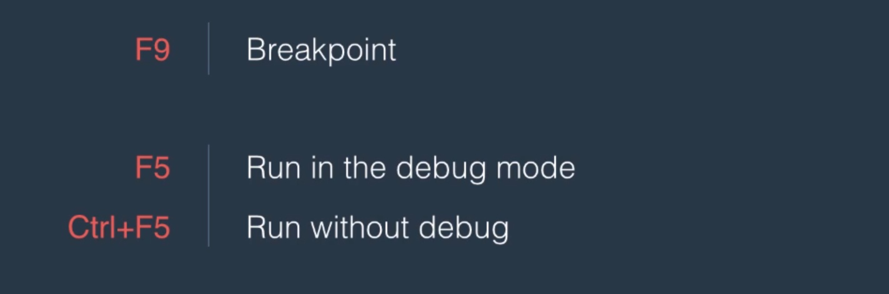
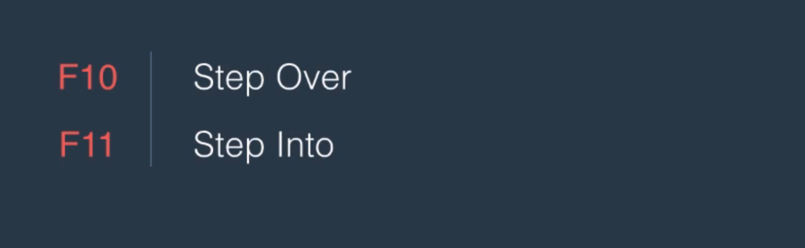
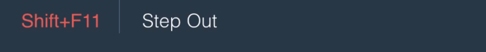
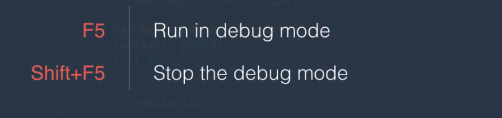
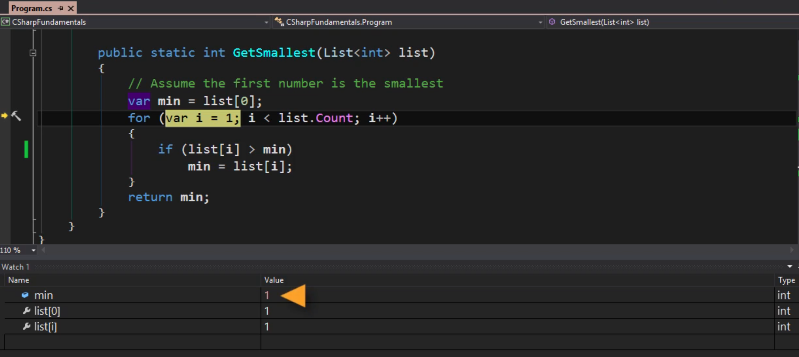

F10 to step over and F11 to step into on breakpoints

Watch Window

Call Stack Window
It is used to view all the calls from beginning to the current position

Autos and Locals windows are also used for debugging purpose.