**Introduction to .NET Framework**

In C++, source code is compiled directly into machine code, making it dependent on the specific machine architecture (e.g., x86).

**Java's Approach to Platform Independence**

Java introduced the concept of intermediate code (bytecode) to achieve platform independence.

**C# and the .NET Framework**

C# adopted a similar approach to create a machine-independent language.

**Code Organization in C#**

In C#, code is organized using classes, namespaces, and assemblies:

**Assemblies in a C# Application**

An application can consist of multiple assemblies:

 

**Data Types**

We need to assign a value to a variable at the time of declaration, else compiler will throw an error.

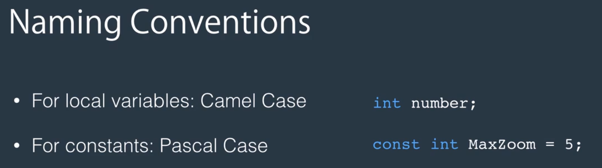
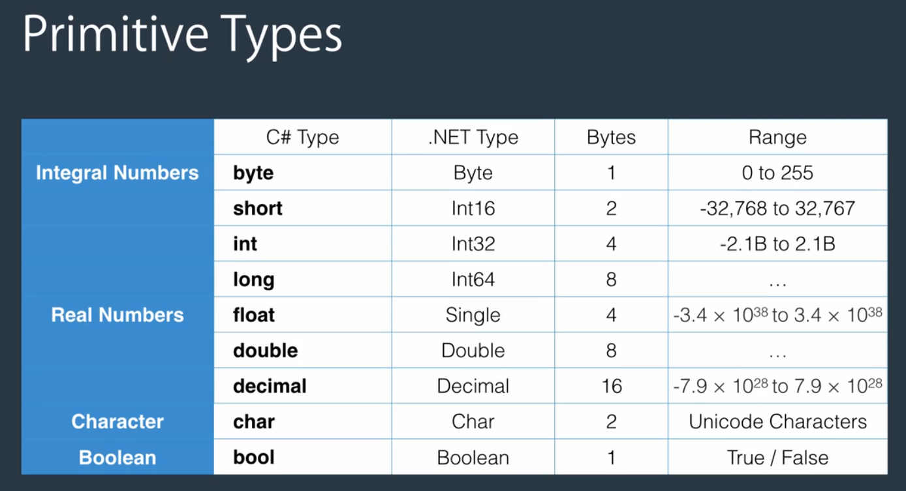

Double is the default data type used by csharp compiler when dealing with real numbers. If we don't follow
the proper conventions when declaring a  real number variables, compiler will consider them double like
in the below example:
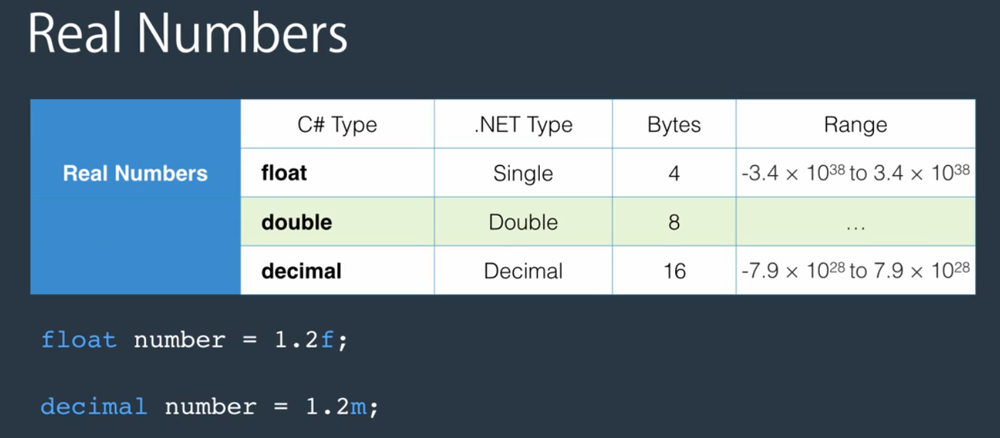

Non Primitive Data Types
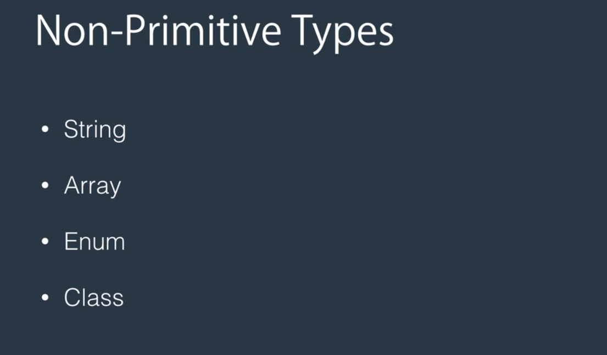

**Overflowing**
If we go beyond the limit of a real number data type, compiler will assign zero to it.
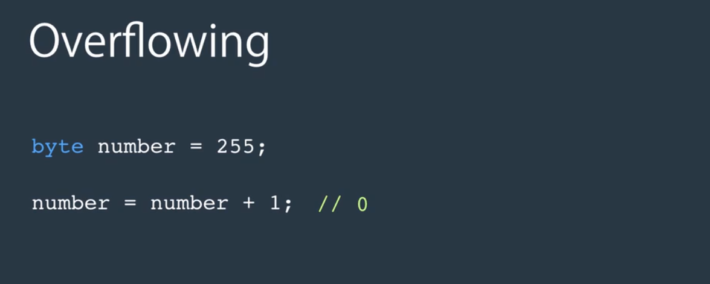
If we want to throw an exception at runtime also, we use the below approach:
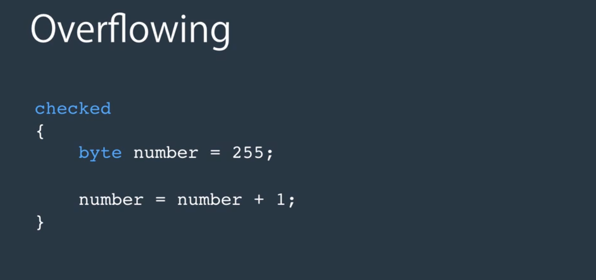

**Scope of a Variable**
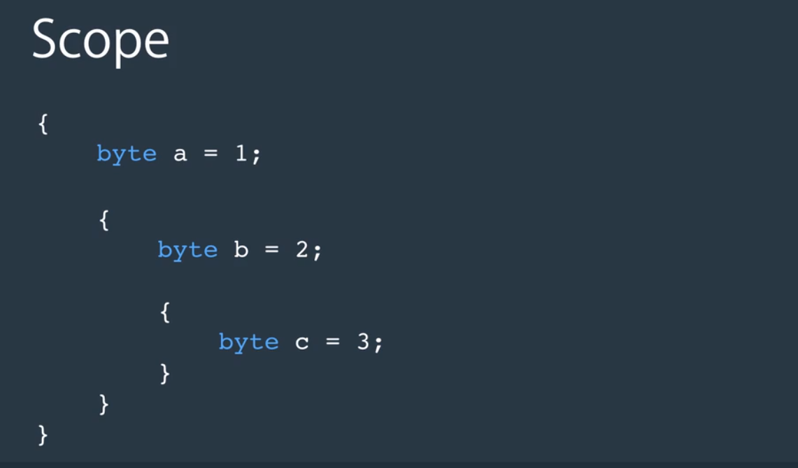

**Implicit Type Conversion**
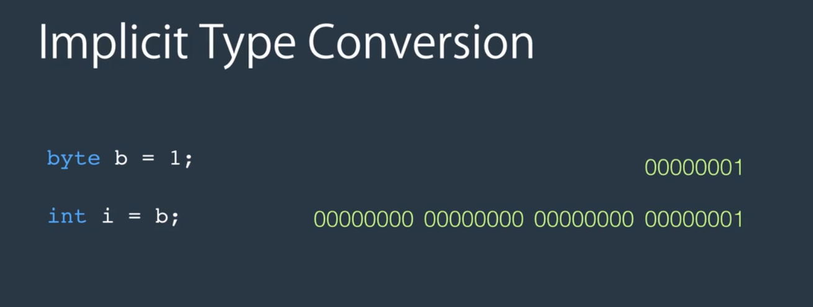
**Explicit Type Converstion**
The below example won't work:
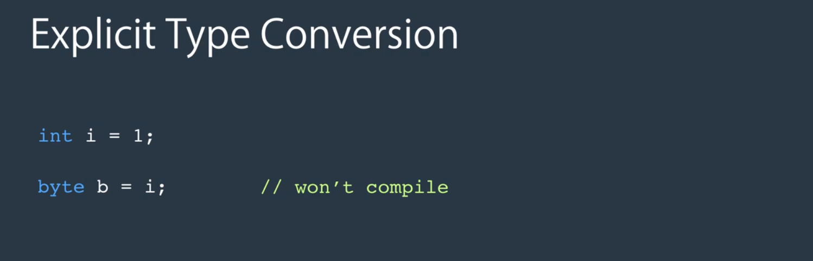
You need to tell the compiler explicitly that you are aware of data loss, but you still want to convert it:
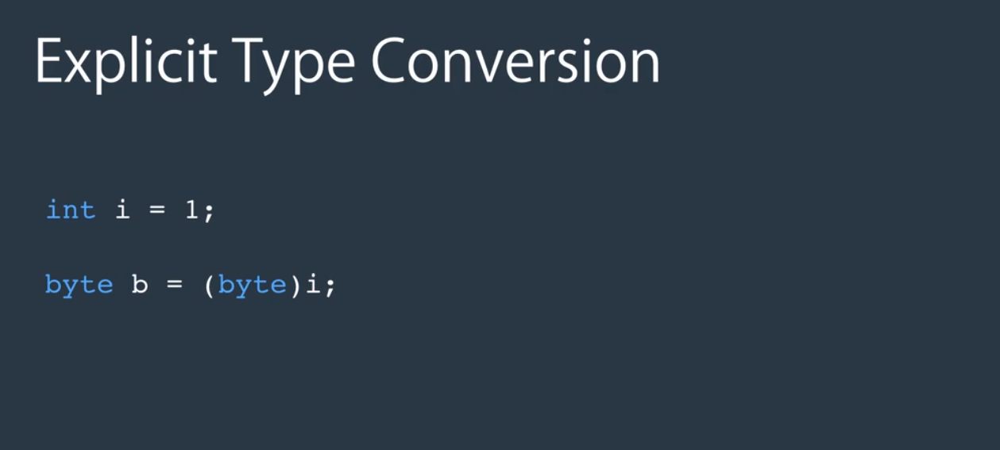
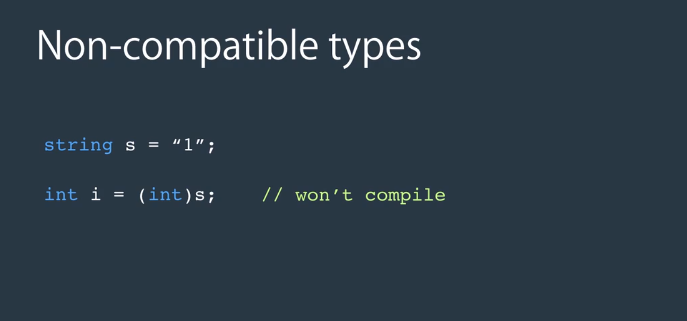
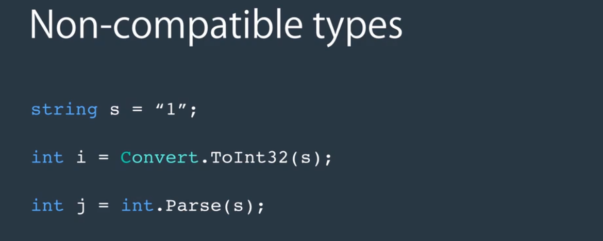

**Latest Dotnet**
The latest version of the .NET Runtime enables you to instantiate an object without having to repeat the type name (target-typed constructor invocation). For example, the following code will create a new instance of the Random class:
Random dice = new();