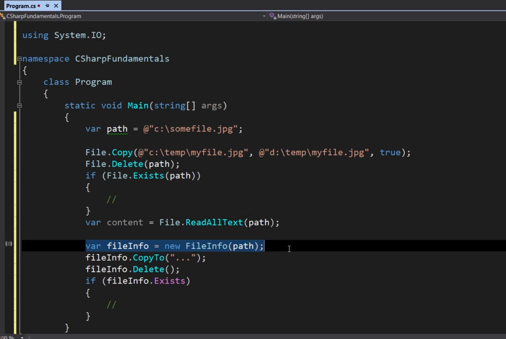

**Introduction to .NET Framework**

In C++, source code is compiled directly into machine code, making it dependent on the specific machine architecture (e.g., x86).


**Java's Approach to Platform Independence**

Java introduced the concept of intermediate code (bytecode) to achieve platform independence.


**C# and the .NET Framework**

C# adopted a similar approach to create a machine-independent language.


**Code Organization in C#**

In C#, code is organized using classes, namespaces, and assemblies:


**Assemblies in a C# Application**

An application can consist of multiple assemblies:

 

**Data Types**

We need to assign a value to a variable at the time of declaration, else compiler will throw an error.


---

### 🐫 **CamelCase**
**Definition**: A naming style where the first word is lowercase, and each subsequent word starts with an uppercase letter.

**Example**:
```csharp
string userName;
bool isLoggedIn;
```

---

### 🐍 **PascalCase**
**Definition**: Similar to CamelCase, but **every** word, including the first, starts with an uppercase letter.

**Example**:
```csharp
class UserProfile {}
string FirstName;
void GetUserInfo() {}
```

---

### 🇭🇺 **Hungarian Notation**
**Definition**: A naming style that prefixes variable names with letters indicating their **type** or **usage**.

**Example**:
```csharp
int iCount;       // 'i' for integer
string strName;   // 'str' for string
bool bIsVisible;  // 'b' for boolean
```

---


Double is the default data type used by csharp compiler when dealing with real numbers. If we don't follow
the proper conventions when declaring a  real number variables, compiler will consider them double like
in the below example:


**Overflowing**
If we go beyond the limit of a real number data type, compiler will assign zero to it.


If we want to throw an exception at runtime also, we use the below approach:


**Scope of a Variable**


**Implicit Type Conversion**


**Explicit Type Converstion**

The below example won't work:

You need to tell the compiler explicitly that you are aware of data loss, but you still want to convert it:


String, Int32 they are imported from dotnet library, while int, string are not, but they are the
same thing


**Non-primitive Data Types**


**Static Methods**

Static methods are created per class rather than the per instance of the class in memory


**Strings**
Strings are immutable:


**Enums**


**Value Types and Reference Types**


Below ss hightlight how memoery is managed on stack:


and the below ss shows how memory is managed on heap of reference types:


**Foreach Loop**


**Random Class**

.png>)

**Latest Dotnet**
The latest version of the .NET Runtime enables you to instantiate an object without having to repeat the type name (target-typed constructor invocation). For example, the following code will create a new instance of the Random class:
Random dice = new();

**Multi Dimmensional Arrays**

Below is the code snippet of how we use multi dimmensional arrays in C#


**Jaggad Arrays**


Below ss highlights the difference between the jaggad arrays and the multi dimmensional arrays:


**Lists in C#**


Lists in action:


**Working with DateTime**


TimeSpan


**Strings**


ToString takes formatters as parameters


StringBuilder


**Working with files**


File provides static whereas Fileinfo is instantiated:



Directory


Working with path:

